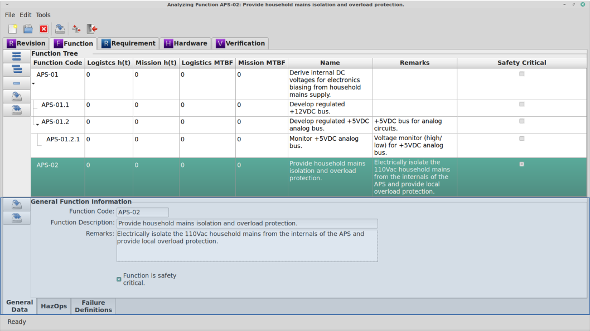

.. _sec-function:

Function Module
===============

The Function Module is the used to document and analyze the functions of a
system.

.. _sec-function-module-book:
Module Book
-----------

When the Function tab is selected in the Module Book, a hierarchical tree of all
the Functions associated with the selected Revision is displayed.  The
attributes displayed for each Function are determined by the settings in the
:ref:`sec-ramstk-user-configuration` file.  The following attributes are
available for display in the Function tab of the Module Book.

.. tabularcolumns:: |r|l|
.. table:: **Function Attributes Available to Module Book**

   +-----------------------------------------+----------+
   | Attribute                               | Editable |
   +=========================================+==========+
   | Revision ID                             | No       |
   +-----------------------------------------+----------+
   | Function ID                             | No       |
   +-----------------------------------------+----------+
   | Logistics Availability                  | No       |
   +-----------------------------------------+----------+
   | Mission Availability                    | No       |
   +-----------------------------------------+----------+
   | Cost                                    | No       |
   +-----------------------------------------+----------+
   | Function Code                           | Yes      |
   +-----------------------------------------+----------+
   | Logistics Failure Rate                  | No       |
   +-----------------------------------------+----------+
   | Mission Failure Rate                    | No       |
   +-----------------------------------------+----------+
   | Indenture Level                         | No       |
   +-----------------------------------------+----------+
   | Mean Maintenance Time                   | No       |
   +-----------------------------------------+----------+
   | Mean Corrective Maintenance Time        | No       |
   +-----------------------------------------+----------+
   | Mean Predictive Maintenance Time        | No       |
   +-----------------------------------------+----------+
   | Logistics MTBF                          | No       |
   +-----------------------------------------+----------+
   | Mission MTBF                            | No       |
   +-----------------------------------------+----------+
   | Mean Time to Repair                     | No       |
   +-----------------------------------------+----------+
   | Function Description                    | Yes      |
   +-----------------------------------------+----------+
   | Parent ID                               | No       |
   +-----------------------------------------+----------+
   | Remarks                                 | Yes      |
   +-----------------------------------------+----------+
   | Safety Critical                         | Yes      |
   +-----------------------------------------+----------+
   | Total Mode Count                        | No       |
   +-----------------------------------------+----------+
   | Total Part Count                        | No       |
   +-----------------------------------------+----------+

Selecting the Function you wish to work with from the displayed tree will cause
the Function module Work Book to display the attributes of the selected
Function.  This will also cause other work streams associated with the
Function module to load their attributes.

Adding and Removing Functions from the Module Book
^^^^^^^^^^^^^^^^^^^^^^^^^^^^^^^^^^^^^^^^^^^^^^^^^^
To add a new Function at the same indenture level as the currently selected
Function:

* Press the 'Add Sibling' button to the left of the function tree.
* Right click on the function tree and select 'Add Sibling' from the pop-up menu.

To add a new Function one indenture level lower than the currently selected
Function:

* Press the 'Add Child' button to the left of the function tree.
* Right click on the function tree and select 'Add Child' from the pop-up menu.

To remove the currently selected Function from the open `RAMSTK` Program
database:

* Press the 'Remove' button to the left of the function tree.
* Right click on the function tree and select 'Remove' from the pop-up menu.

You will be presented with a dialog confirming you want to delete the selected
Function and all associated data.  Confirm your intentions to complete the
removal.

Saving Functions from the Module Book
^^^^^^^^^^^^^^^^^^^^^^^^^^^^^^^^^^^^^
To save changes to the currently selected Function:

* Press the 'Save' button to the left of the function tree.
* Right click on the function tree and select 'Save' from the pop-up menu.

All pending changes to the selected Function are committed to the open `RAMSTK`
Program database.

To save changes to all Functions:

* Press the 'Save All' button to the left of the function tree.
* Right click on the function tree and select 'Save All' from the pop-up menu.

Pending changes to all Functions associated with the selected Revision are
committed to the open `RAMSTK` Program database.

.. _sec-function-module-book:
Work Book
---------

The Function module Work Book has a General Data and a Functional Hazards
Analysis page.  The following attributes are displayed in the Function's
General Data page.

.. tabularcolumns:: |r|l|
.. table:: **Function Attributes in the Work Book**

   +-----------------------------------------+----------+
   | Attribute                               | Editable |
   +=========================================+==========+
   | Function Code                           | Yes      |
   +-----------------------------------------+----------+
   | Function Description                    | Yes      |
   +-----------------------------------------+----------+
   | Remarks                                 | Yes      |
   +-----------------------------------------+----------+
   | Safety Critical                         | Yes      |
   +-----------------------------------------+----------+

A function code is a unique identifier for a Function you define.  It could
be any alpha-numeric coding system you define.  For example, in a hydraulic
system:

* Pressure related functions might be coded as P-001, P-002, etc. or PRESS-1.1, PRESS-1.2, etc.
* Temperature related function might be coded as T-1, T-2, etc. or TEMP-01, TEMP-02, etc.

The function description is the definition of the Function.

Remarks can be entered for the function.  These can be any sort of
information you deem pertinent to the selected Function.

If the function is safety-critical, check the safety critical checkbutton to
indicate the function's safety criticality.

Saving Functions from the Work Book
^^^^^^^^^^^^^^^^^^^^^^^^^^^^^^^^^^^
To save changes to the currently selected Function, press the 'Save' button
to the left of the work space.  All pending changes are committed to the
open `RAMSTK` Program database.

To save changes to all Functions associated with the selected Revision, press
the 'Save All' button to the left of the work space.  Pending changes to all
Functions are committed to the open `RAMSTK` Program database.

Lists Book
----------
There are no modules associated with Functions that are displayed in the List
Book.

Analyzing the Function
----------------------
The functional hazard analysis (FHA) is the only analysis associated with the
Function work stream.  See :ref:`sec-hazards` for instructions to perform a
FHA with `RAMSTK`.
