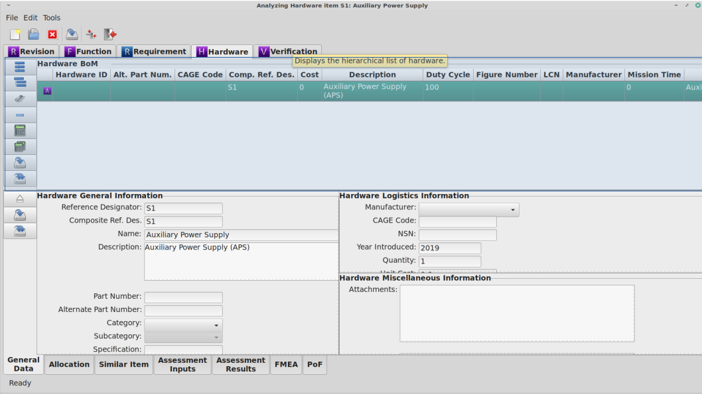
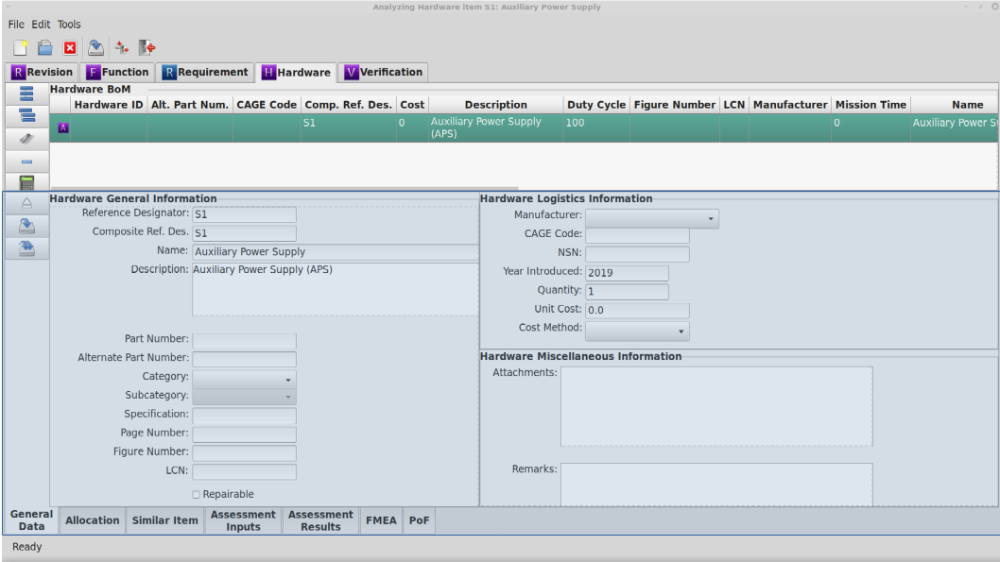
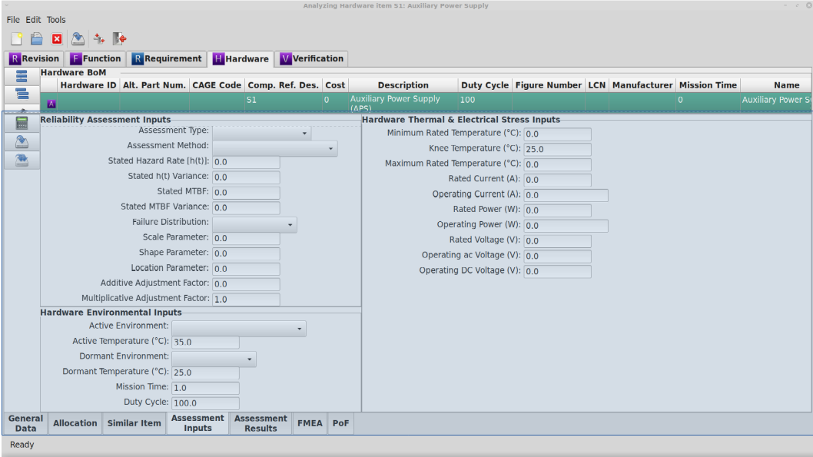
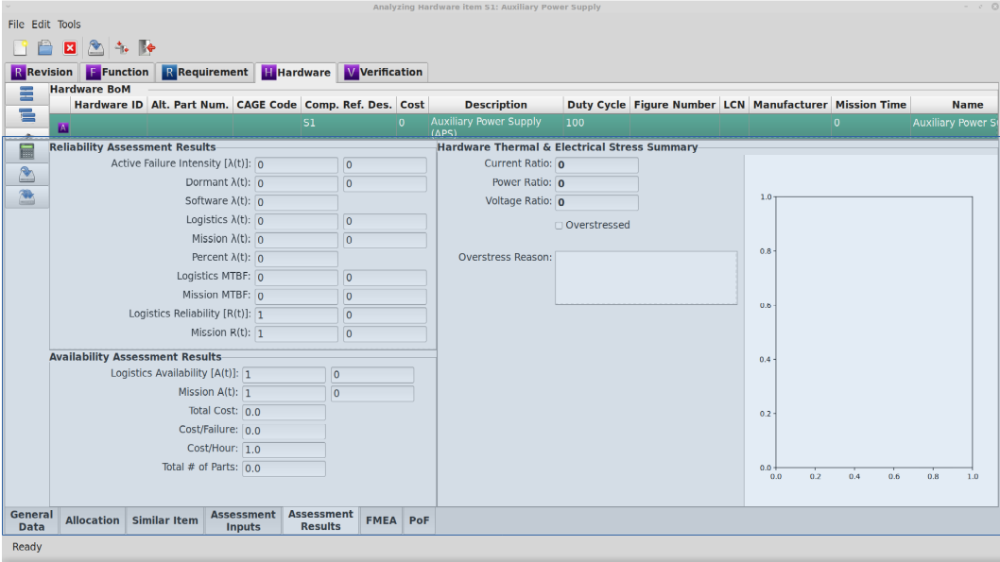

.. _sec-hardware:

Hardware Module
===============

The Hardware Module is the used to document and analyze the hardware that
comprises a system.  The Hardware Module is the workhorse of RAMSTK.

.. _sec-hardware-module-book:

Module Book
-----------

When the Hardware tab is selected in the Module Book, a hierarchical tree of all
the Hardware associated with the selected Revision is displayed.  This
hierarchical view is referred to as a bill of materials (BoM).  There are
many types of BoM for different uses.  The BoM in RAMSTK is an engineering
BoM.

There are two types of Hardware items found in the BoM, assemblies and piece
parts.  Assemblies are complex hardware items comprised of piece parts and
even other assemblies.  Piece parts, on the other hand, are the basic
building blocks of the hardware system being analyzed.

The attributes displayed for each Hardware item are determined by the
settings in the hardware.toml file (see :ref:`sec-ramstk-user-configuration`)
.  The following attributes are available for display in the Hardware tab of
the Module Book.

.. tabularcolumns:: |r|l|l|
.. table:: **Hardware Attributes Available to Module Book**

   +---------------------------+----------+------------------------------------+
   | Attribute                 | Editable | Source of Data                     |
   +===========================+==========+====================================+
   | Revision ID               | No       | Assigned by database.              |
   +---------------------------+----------+------------------------------------+
   | Hardware ID               | No       | Assigned by database.              |
   +---------------------------+----------+------------------------------------+
   | Alt. Part Number          | Yes      | Free form entry.                   |
   +---------------------------+----------+------------------------------------+
   | CAGE Code                 | Yes      | Free form entry.                   |
   +---------------------------+----------+------------------------------------+
   | Comp. Reference Designator| Yes      | Free form entry.                   |
   +---------------------------+----------+------------------------------------+
   | Cost/Unit                 | Yes      | Free form entry.                   |
   +---------------------------+----------+------------------------------------+
   | Cost/Failure              | No       | Calculated value.                  |
   +---------------------------+----------+------------------------------------+
   | Cost/Hour                 | No       | Calculated value.                  |
   +---------------------------+----------+------------------------------------+
   | Description               | Yes      | Free form entry.                   |
   +---------------------------+----------+------------------------------------+
   | Duty Cycle                | Yes      | Free form entry.                   |
   +---------------------------+----------+------------------------------------+
   | Figure Number             | Yes      | Free form entry.                   |
   +---------------------------+----------+------------------------------------+
   | Logistics Control Number  | Yes      | Free form entry.                   |
   +---------------------------+----------+------------------------------------+
   | Level                     | No       | Assigned by database.              |
   +---------------------------+----------+------------------------------------+
   | Manufacturer              | Yes      | Pick list stored in Site database. |
   +---------------------------+----------+------------------------------------+
   | Mission Time              | Yes      | Free form entry.                   |
   +---------------------------+----------+------------------------------------+
   | Name                      | Yes      | Free form entry.                   |
   +---------------------------+----------+------------------------------------+
   | National Stock Number     | Yes      | Free form entry.                   |
   +---------------------------+----------+------------------------------------+
   | Page Number               | Yes      | Free form entry.                   |
   +---------------------------+----------+------------------------------------+
   | Parent ID                 | No       | Assigned by database.              |
   +---------------------------+----------+------------------------------------+
   | Part                      | Yes      | Check button.                      |
   +---------------------------+----------+------------------------------------+
   | Part Number               | Yes      | Free form entry.                   |
   +---------------------------+----------+------------------------------------+
   | Quantity                  | Yes      | Free form entry.                   |
   +---------------------------+----------+------------------------------------+
   | Reference Designator      | Yes      | Free form entry.                   |
   +---------------------------+----------+------------------------------------+
   | Remarks                   | Yes      | Free form entry.                   |
   +---------------------------+----------+------------------------------------+
   | Repairable                | Yes      | Check button.                      |
   +---------------------------+----------+------------------------------------+
   | Specification Number      | Yes      | Free form entry.                   |
   +---------------------------+----------+------------------------------------+
   | Tagged Part               | Yes      | Check button.                      |
   +---------------------------+----------+------------------------------------+
   | Total Part Count          | No       | Calculated value.                  |
   +---------------------------+----------+------------------------------------+
   | Total Power Dissipation   | No       | Calculated value.                  |
   +---------------------------+----------+------------------------------------+
   | Year of Manufacture       | Yes      | Free form entry.                   |
   +---------------------------+----------+------------------------------------+
   | Cost Type                 | Yes      | Pick list.                         |
   +---------------------------+----------+------------------------------------+
   | Attachments               | Yes      | Free form entry.                   |
   +---------------------------+----------+------------------------------------+
   | Category                  | Yes      | Pick list stored in Site database. |
   +---------------------------+----------+------------------------------------+
   | Subcategory               | Yes      | Pick list stored in Site database. |
   +---------------------------+----------+------------------------------------+

Selecting the Hardware you wish to work with from the displayed tree will cause
the Hardware module Work Book to display the attributes of the selected
Hardware.  This will also cause other work streams associated with the
Hardware module to load their attributes.

Adding and Removing Hardware Items from the Module Book
^^^^^^^^^^^^^^^^^^^^^^^^^^^^^^^^^^^^^^^^^^^^^^^^^^^^^^^
A new RAMSTK Program database will have one hardware item, the system.
Recall that Hardware items are hierarchical.  Sibling hardware shares the same
level in the hierarchy.  Child hardware are at the next lower level in the
hierarchy.

To add a new Hardware assembly at the same indenture level (sibling) as the
currently selected Hardware assembly:

* Press the 'Add Sibling' button to the left of the hardware tree.
* Right click on the hardware tree and select 'Add Sibling' from the pop-up menu.

For the top-level Hardware item, the system, only children can be added.

To add a new Hardware assembly one indenture level lower (child) than the
currently selected Hardware assembly:

* Press the 'Add Child' button to the left of the hardware tree.
* Right click on the hardware tree and select 'Add Child' from the pop-up menu.

To add a new Hardware piece part one indenture level lower than the currently
selected Hardware assembly:

* Press the 'Add Piece' button to the left of the hardware tree.
* Right click on the hardware tree and select 'Add Piece Part' from the pop-up menu.

To remove the currently selected Hardware item, whether an assembly or a
piece part, from the open `RAMSTK` Program database:

* Press the 'Remove' button to the left of the hardware tree.
* Right click on the hardware tree and select 'Remove' from the pop-up menu.

You will be presented with a dialog confirming you want to delete the selected
Hardware item and all associated data.  Confirm your intentions to complete the
removal.

Saving Hardware Items from the Module Book
^^^^^^^^^^^^^^^^^^^^^^^^^^^^^^^^^^^^^^^^^^
To save changes to the currently selected Hardware item:

* Press the 'Save' button to the left of the hardware tree.
* Right click on the hardware tree and select 'Save' from the pop-up menu.

All pending changes to the selected Hardware are committed to the open `RAMSTK`
Program database.

To save changes to all Hardware items in the BoM:

* Press the 'Save All' button to the left of the hardware tree.
* Right click on the hardware tree and select 'Save All' from the pop-up menu.

Pending changes to all Hardware items associated with the selected Revision are
committed to the open `RAMSTK` Program database.

.. _sec-hardware-work-book:

Work Book
---------

The Hardware module Work Book has a General Data, an Assessment Inputs, and
an Assessment Results page.  These pages allow entry of information related
to hardware items and the assessment of the system's reliability.  There are
other, hardware related analyses whose pages may appear in the Hardware
module Work Book.  These analyses are discussed in their respective sections,
but include reliability Allocation, Similar Item Analysis, Failure Mode and
Effects Analysis, and Physics of Failure analysis.

General Data Page
^^^^^^^^^^^^^^^^^
The Hardware module Work Book General Data page is divided into three panes.
These panes are for general information, logistics information, and
miscellaneous information related to the selected Hardware item.  The
following attributes are displayed in the general information pane.

.. tabularcolumns:: |r|l|l|
.. table:: **Hardware Attributes in the General Information Pane**

   +---------------------------+----------+------------------------------------+
   | Attribute                 | Editable | Source of Data                     |
   +===========================+==========+====================================+
   | Reference Designator      | Yes      | Free form entry.                   |
   +---------------------------+----------+------------------------------------+
   | Composite Ref. Des.       | No       | Calculated value.                  |
   +---------------------------+----------+------------------------------------+
   | Name                      | Yes      | Free form entry.                   |
   +---------------------------+----------+------------------------------------+
   | Description               | Yes      | Free form entry.                   |
   +---------------------------+----------+------------------------------------+
   | Part Number               | Yes      | Free form entry.                   |
   +---------------------------+----------+------------------------------------+
   | Alternate Part Number     | Yes      | Free form entry.                   |
   +---------------------------+----------+------------------------------------+
   | Category                  | Yes      | Pick list stored in Site database. |
   +---------------------------+----------+------------------------------------+
   | Subcategory               | Yes      | Pick list stored in Site database. |
   +---------------------------+----------+------------------------------------+
   | Specification             | Yes      | Free form entry.                   |
   +---------------------------+----------+------------------------------------+
   | Page Number               | Yes      | Free form entry.                   |
   +---------------------------+----------+------------------------------------+
   | Figure Number             | Yes      | Free form entry.                   |
   +---------------------------+----------+------------------------------------+
   | LCN                       | Yes      | Free form entry.                   |
   +---------------------------+----------+------------------------------------+
   | Repairable                | Yes      | Check button.                      |
   +---------------------------+----------+------------------------------------+

The following attributes are displayed in the logistics information pane.

.. tabularcolumns:: |r|l|l|
.. table:: **Hardware Attributes in the Logistics Information Pane**

   +---------------------------+----------+------------------------------------+
   | Attribute                 | Editable | Source of Data                     |
   +===========================+==========+====================================+
   | Manufacturer              | Yes      | Pick list stored in Site database. |
   +---------------------------+----------+------------------------------------+
   | CAGE Code                 | Yes      | Free form entry.  Auto populated   |
   |                           |          | when selecting a manufacturer.     |
   +---------------------------+----------+------------------------------------+
   | NSN                       | Yes      | Free form entry.                   |
   +---------------------------+----------+------------------------------------+
   | Year Introduced           | Yes      | Free form entry.                   |
   +---------------------------+----------+------------------------------------+
   | Quantity                  | Yes      | Free form entry.                   |
   +---------------------------+----------+------------------------------------+
   | Unit Cost                 | Yes      | Free form entry.                   |
   +---------------------------+----------+------------------------------------+
   | Cost Method               | Yes      | Pick list.                         |
   +---------------------------+----------+------------------------------------+

The following attributes are displayed in the miscellaneous information pane.

.. tabularcolumns:: |r|l|l|
.. table:: **Hardware Attributes in the Miscellaneous Information Pane**

   +---------------------------+----------+------------------------------------+
   | Attribute                 | Editable | Source of Data                     |
   +===========================+==========+====================================+
   | Attachments               | Yes      | Free form entry.                   |
   +---------------------------+----------+------------------------------------+
   | Remarks                   | Yes      | Free form entry.                   |
   +---------------------------+----------+------------------------------------+
   | Tagged Part               | Yes      | Check button.                      |
   +---------------------------+----------+------------------------------------+

Assessment Inputs Page
^^^^^^^^^^^^^^^^^^^^^^
.. _hw_assessment_inputs:

   :numref:`Hardware Assessment Inputs Page`

The Assessment Inputs page is where all of the information required to assess
the reliability of hardware items is entered.  `RAMSTK` currently supports
the following assessment methods:

* MIL-HDBK-217F, Notice 2 Parts Count
* MIL-HDBK-217F, Notice 2 Part Stress
* Specified hazard rate
* Specified MTBF

The assessment inputs page is divided into three panes.  These panes are for
reliability assessment methods, hardware environmental, and hardware thermal
and electrical stress inputs.  If the selected Hardware item is a piece part
and you've selected one of the MIL-HDBK-217F methods, a fourth pane will be
visible for entering the MIL-HDBK-217F specific information.

The following attributes are displayed in the reliability assessment pane.

.. tabularcolumns:: |r|l|l|
.. table:: **Hardware Attributes in the Reliability Assessment Pane**

   +---------------------------+----------+------------------------------------+
   | Attribute                 | Editable | Source of Data                     |
   +===========================+==========+====================================+
   | Assessment Type           | Yes      | Pick list stored in Site database. |
   +---------------------------+----------+------------------------------------+
   | Assessment Method         | Yes      | Pick list stored in Site database. |
   +---------------------------+----------+------------------------------------+
   | Stated Hazard Rate h(t)   | Yes      | Free form entry.                   |
   +---------------------------+----------+------------------------------------+
   | Stated h(t) Variance      | Yes      | Free form entry.                   |
   +---------------------------+----------+------------------------------------+
   | Stated MTBF               | Yes      | Free form entry.                   |
   +---------------------------+----------+------------------------------------+
   | Stated MTBF Variance      | Yes      | Free form entry.                   |
   +---------------------------+----------+------------------------------------+
   | Failure Distribution      | Yes      | Pick list stored in Site database. |
   +---------------------------+----------+------------------------------------+
   | Scale Parameter           | Yes      | Free form entry.                   |
   +---------------------------+----------+------------------------------------+
   | Shape Parameter           | Yes      | Free form entry.                   |
   +---------------------------+----------+------------------------------------+
   | Location Parameter        | Yes      | Free form entry.                   |
   +---------------------------+----------+------------------------------------+
   | Add. Adjustment Factor    | Yes      | Free form entry.                   |
   +---------------------------+----------+------------------------------------+
   | Mult. Adjustment Factor   | Yes      | Free form entry.                   |
   +---------------------------+----------+------------------------------------+

The following attributes are displayed in the hardware environment pane.

.. tabularcolumns:: |r|l|l|
.. table:: **Hardware Attributes in the Hardware Environment Pane**

   +---------------------------+----------+------------------------------------+
   | Attribute                 | Editable | Source of Data                     |
   +===========================+==========+====================================+
   | Active Environment        | Yes      | Pick list stored in Site database. |
   +---------------------------+----------+------------------------------------+
   | Active Temperature        | Yes      | Free form entry.                   |
   +---------------------------+----------+------------------------------------+
   | Dormant Environment       | Yes      | Pick list stored in Site database. |
   +---------------------------+----------+------------------------------------+
   | Dormant Temperature       | Yes      | Free form entry.                   |
   +---------------------------+----------+------------------------------------+
   | Mission Time              | Yes      | Free form entry.                   |
   +---------------------------+----------+------------------------------------+
   | Duty Cycle                | Yes      | Free form entry.                   |
   +---------------------------+----------+------------------------------------+

The following attributes are displayed in the hardware thermal and electrical
stress pane.

.. tabularcolumns:: |r|l|l|
.. table:: **Hardware Attributes in the Thermal & Electrical Stress Pane**

   +---------------------------+----------+------------------------------------+
   | Attribute                 | Editable | Source of Data                     |
   +===========================+==========+====================================+
   | Min. Rated Temperature    | Yes      | Free form entry.                   |
   +---------------------------+----------+------------------------------------+
   | Knee Temperature          | Yes      | Free form entry.                   |
   +---------------------------+----------+------------------------------------+
   | Max. Rated Temperature    | Yes      | Free form entry.                   |
   +---------------------------+----------+------------------------------------+
   | Rated Current             | Yes      | Free form entry.                   |
   +---------------------------+----------+------------------------------------+
   | Operating Current         | Yes      | Free form entry.                   |
   +---------------------------+----------+------------------------------------+
   | Rated Power               | Yes      | Free form entry.                   |
   +---------------------------+----------+------------------------------------+
   | Operating Power           | Yes      | Free form entry.                   |
   +---------------------------+----------+------------------------------------+
   | Rated Voltage             | Yes      | Free form entry.                   |
   +---------------------------+----------+------------------------------------+
   | Operating ac Voltage      | Yes      | Free form entry.                   |
   +---------------------------+----------+------------------------------------+
   | Operating DC Voltage      | Yes      | Free form entry.                   |
   +---------------------------+----------+------------------------------------+

Assessment Results Page
^^^^^^^^^^^^^^^^^^^^^^^

The Assessment Results page is where all of the calculated information is
displayed.

The assessment results page is divided into three panes.  These panes are for
reliability assessment results, availability assessment results, and hardware
thermal and electrical stress results.  If the selected Hardware item is a
piece part and you've selected one of the MIL-HDBK-217F methods, a fourth
pane will be visible for displaying the MIL-HDBK-217F specific results.

The following attributes are displayed in the reliability assessment
results pane.

.. tabularcolumns:: |r|l|l|
.. table:: **Hardware Attributes in the Reliability Assessment Results Pane**

   +---------------------------+----------+------------------------------------+
   | Attribute                 | Editable | Source of Data                     |
   +===========================+==========+====================================+
   | Active Failure Intensity  | No       | Calculated value.                  |
   +---------------------------+----------+------------------------------------+
   | Dormant Failure Intensity | No       | Calculated value.                  |
   +---------------------------+----------+------------------------------------+
   | Software Failure Intensity| No       | Calculated value.                  |
   +---------------------------+----------+------------------------------------+
   | Logistic Failure Intensity| No       | Calculated value.                  |
   +---------------------------+----------+------------------------------------+
   | Mission Failure Intensity | No       | Calculated value.                  |
   +---------------------------+----------+------------------------------------+
   | Percent Failure Intensity | No       | Calculated value.                  |
   +---------------------------+----------+------------------------------------+
   | Logistics MTBF            | No       | Calculated value.                  |
   +---------------------------+----------+------------------------------------+
   | Mission MTBF              | No       | Calculated value.                  |
   +---------------------------+----------+------------------------------------+
   | Logistics Reliability     | No       | Calculated value.                  |
   +---------------------------+----------+------------------------------------+
   | Mission Reliability       | No       | Calculated value.                  |
   +---------------------------+----------+------------------------------------+

The following attributes are displayed in the availability assessment
results pane.

.. tabularcolumns:: |r|l|l|
.. table:: **Hardware Attributes in the Reliability Assessment Results Pane**

   +---------------------------+----------+------------------------------------+
   | Attribute                 | Editable | Source of Data                     |
   +===========================+==========+====================================+
   | Logistics Availability    | No       | Calculated value.                  |
   +---------------------------+----------+------------------------------------+
   | Mission Availability      | No       | Calculated value.                  |
   +---------------------------+----------+------------------------------------+
   | Total Cost                | No       | Calculated value.                  |
   +---------------------------+----------+------------------------------------+
   | Cost/Failure              | No       | Calculated value.                  |
   +---------------------------+----------+------------------------------------+
   | Cost/Hour                 | No       | Calculated value.                  |
   +---------------------------+----------+------------------------------------+
   | Total # of Parts          | No       | Calculated value.                  |
   +---------------------------+----------+------------------------------------+

The following attributes are displayed in the thermal and electrical stress
results pane.

.. tabularcolumns:: |r|l|l|
.. table:: **Hardware Attributes in the Thermal & Electrical Stress Results Pane**

   +---------------------------+----------+------------------------------------+
   | Attribute                 | Editable | Source of Data                     |
   +===========================+==========+====================================+
   | Current Ratio             | No       | Calculated value.                  |
   +---------------------------+----------+------------------------------------+
   | Power Ratio               | No       | Calculated value.                  |
   +---------------------------+----------+------------------------------------+
   | Voltage Ratio             | No       | Calculated value.                  |
   +---------------------------+----------+------------------------------------+
   | Overstressed              | No       | Calculated value.                  |
   +---------------------------+----------+------------------------------------+
   | Overstress Reason         | No       | Calculated value.                  |
   +---------------------------+----------+------------------------------------+

In addition to the attributes listed in the table above, the thermal and
electrical stress results pane also includes an operating curve.  Depending
on the type of piece part, this curve will display the operating current,
operating power, or operating voltage as a function of temperature.  There
will be two curves, one for mild environments and one for harsh environments.
The calculated operating point will also be displayed on the curve.

Performing a Reliability Assessment
-----------------------------------
Refer to :ref:`hw_assessment_inputs` figure for location of widgets mentioned
in this section.

To perform a reliability assessment, select a Hardware item in the Hardware
module book.  Next, select the Assessment Inputs page in the Hardware work
book.  In the **Reliability Assessment Inputs** pane, select the assessment
type.  Assessment types available:

* *Assessed* to assess reliability based on a handbook or database hazard rate.
* *Defined, Hazard Rate* to enter a hazard rate for the item manually.
* *Defined, MTBF* to enter a MTBF for the item manually.

If you selected *Assessed*, available assessement methods are:

* *MIL-HDBK-217F, Parts Count* to use the parts count methodology.
* *MIL-HDBK-217F, Parts Stress* to use the part stress methodology.
* *Sum of Parts* to assess reliability based on the sum of immediate childrens' hazard rates.

If you selected one of the defined assessment types, the appropriate entries
will become editable.  Enter the defined hazard rate or MTBF for the selected
assembly or component.

In the **Hardware Environmental Inputs** pane, select the active and dormant
environments from the pick lists.  These two inputs will be used to calculate
the dormant hazard rate regardless of the assessment type and method used.
However, only the MIL-HDBK-217F methods use the active environment input
directly.  Enter the temperature, mission time, and duty cycle information.

The **Hardware Thermal & Electrical Inputs** pane is only for piece-part
assessments.  The minimum, maximum, and knee temperatures are used to
construct the operating limit curves for mild and harsh environments.  These
values are typically found on a component's data sheet.

The rated and operating current, power, and voltage are used to calculate the
operating point of the piece-part and the three stress ratios.  The operating
point is plotted on operating limit curve and provides a visual display of
available margin.  The three stress ratios are compared to various derating
rules to determine whether the component is overstressed in its application.

In the **Design Input** pane, enter the appropriate information for the
selected component category/subcategory combination.  Only those inputs
applicable to the category/subcategory combination will be editable.  This is
only applicable to MIL-HDBK-217F assessment methods and this pane will not be
visible if anther type or method is selected.

Once all the information is entered, press the:

* 'Calculate' button on the Assessment Inputs page.
* 'Calculate' button on the Assessment Results page.
* 'Calculate' button on the Hardware Module Book.
* 'Calculate All' button on the Hardware Module Book.
