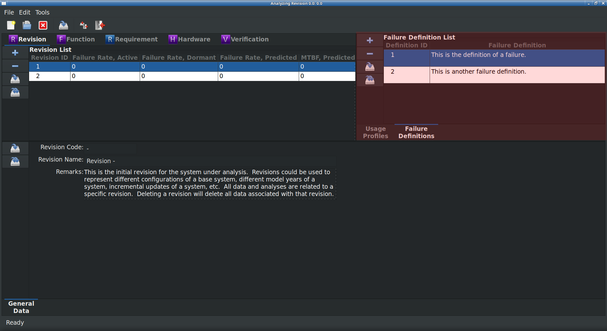

.. _sec-hazards:

Hazards Analysis (HazOp) Module
===============================

Functional hazards analysis (FHA)

Module Book
-----------
Hazards are unable to be displayed in the Module Book.

Work Book
---------

Hazards are displayed in the Work Book when the Function work stream is
selected in the Module Book.  The following attributes are displayed for each
Hazard.

.. tabularcolumns:: |r|l|
.. table:: **Hazard Attributes**

   +---------------+----------+
   | Attribute     | Editable |
   +===============+==========+
   | Definition ID | No       |
   +---------------+----------+
   | Definition    | Yes      |
   +---------------+----------+

Adding and Removing Hazards from the Work Book
^^^^^^^^^^^^^^^^^^^^^^^^^^^^^^^^^^^^^^^^^^^^^^
To add a new Hazard to the open `RAMSTK` Program database:

* Press the 'Add' button to the left of the hazards list.
* Right click on the hazards list and select 'Add' from the pop-up menu.

This will add a new Hazard that is associated with the selected Function.

To remove the currently selected Hazard from the open `RAMSTK` Program
database:

* Press the 'Remove' button to the left of the hazards list.
* Right click on the hazards list and select 'Save All' from the pop-up menu.

You will be presented with a dialog confirming you want to delete the selected
Hazard and all associated data.  Confirm your intentions to complete the
removal.

Saving Hazards
^^^^^^^^^^^^^^
To save changes to the currently selected Hazard:

* Press the 'Save' button to the left of the hazards list.
* Right click on the hazards list and select 'Save' from the pop-up menu.

All pending changes to the currently selected hazards are committed to the
open `RAMSTK` Program database.

To save changes to all Failure Definitions:

* Press the 'Save All' button to the left of the hazards list.
* Right click on the hazards list and select 'Save All' from the pop-up menu.

Pending changes to all Hazards associated with the selected Function are
committed to the open `RAMSTK` Program database.

List Book
---------
Hazards are unable to be displayed in the List Book.

Performing a Functional Hazard Analysis
---------------------------------------
With the desired function selected in the Function
:ref:`sec-function-module-book`, the hazards can be managed in the HazOps tab
in the Function :ref:`sec-function-work-book`.  You can add one or more
hazards following the steps above.  Once a hazard has been added, it can be
analyzed.

Using the default layout for a Hazard analysis with all columns visible,
enter the following information:

#. Select a hazard from the drop down menu.  The list presented is a
site-wide configuration and may be edited in the `RAMSTK` Site database by
anyone with administrator privileges.
#. Enter any potential causes of the selected hazard.  This is a free-form
field that is not used in any hazard assessment.  It is for information only.
#. Describe the effect the hazard would have on the hardware assembly
implementing the function without a mitigation strategy.
#. Select the assembly level severity without a mitigation strategy from the
drop down menu.
#. Select the probability of the hazard occurring without a mitigation
strategy from the drop down menu.
#. The Hazard Risk Index (HRI) without a mitigation strategy is a calculated
value.
#. Describe any mitigation strategies the design will incorporate to address
the hazard.
#. Select the assembly level severity with a mitigation strategy from the
drop down menu.
#. Select the probability of the hazard occurring with a mitigation
strategy from the drop down menu.
#. The HRI with a mitigation strategy is a calculated value.
#. Describe the effect the hazard would have on the hardware system without a
mitigation strategy.
#. Select the system level severity without a mitigation strategy from the
drop down menu.
#. Select the probability of the hazard occurring without a mitigation
strategy from the drop down menu.
#. The HRI without a mitigation strategy is a calculated value.
#. Describe any mitigation strategies the design will incorporate to address
the hazard.
#. Select the system level severity with a mitigation strategy from the
drop down menu.
#. Select the probability of the hazard occurring with a mitigation
strategy from the drop down menu.
#. The HRI with a mitigation strategy is a calculated value.
#. Enter any remarks associated with the hazard.
#. Calculate the HRI by pressing the 'Calculate' button to the left of the
hazard list.
