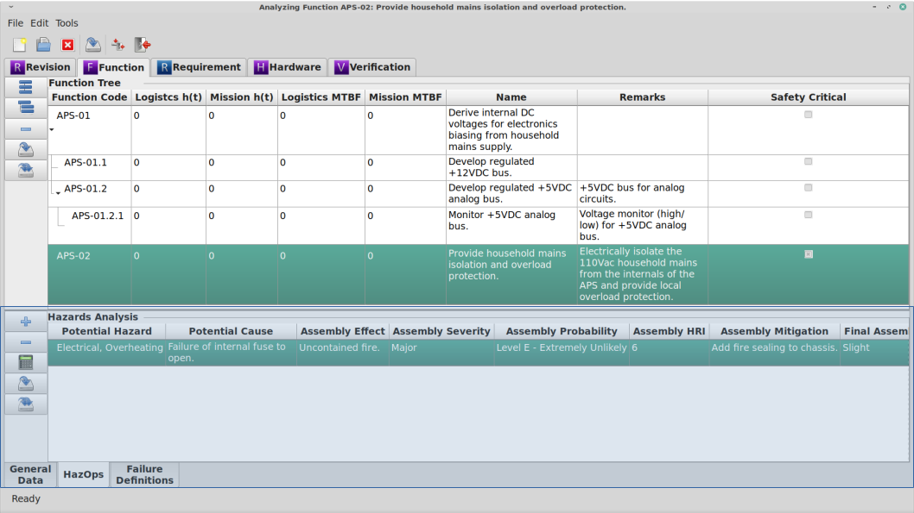

.. _sec-hazards:

Hazards Analysis (HazOp) Module
===============================

Functional hazards analysis (FHA)

Module Book
-----------
Hazards are unable to be displayed in the Module Book.

Work Book
---------

Hazards are displayed in the Work Book when the Function work stream is
selected in the Module Book.  The following attributes are displayed for each
Hazard.

.. tabularcolumns:: |r|l|l|
.. table:: **Hazard Attributes**

   +----------------------+----------+------------------------------------+
   | Attribute            | Editable | Source of Data                     |
   +======================+==========+====================================+
   | Revision ID          | No       | Assigned by database.              |
   +----------------------+----------+------------------------------------+
   | Function ID          | No       | Assigned by database.              |
   +----------------------+----------+------------------------------------+
   | Hazard ID            | No       | Assigned by database.              |
   +----------------------+----------+------------------------------------+
   | Potential Hazard     | Yes      | Pick list stored in Site database. |
   +----------------------+----------+------------------------------------+
   | Potential Cause      | Yes      | Free form entry.                   |
   +----------------------+----------+------------------------------------+
   | Assembly Effect      | Yes      | Free form entry.                   |
   +----------------------+----------+------------------------------------+
   | Assembly Severity    | Yes      | Pick list stored in Site database. |
   +----------------------+----------+------------------------------------+
   | Assembly Probability | Yes      | Pick list stored in Site database. |
   +----------------------+----------+------------------------------------+
   | Assembly HRI         | No       | Calculated value.                  |
   +----------------------+----------+------------------------------------+
   | Assembly Mitigation  | Yes      | Free form entry.                   |
   +----------------------+----------+------------------------------------+
   | Assembly Severity    | Yes      | Pick list stored in Site database. |
   | after mitigation     |          |                                    |
   +----------------------+----------+------------------------------------+
   | Assembly Probability | Yes      | Pick list stored in Site database. |
   | after mitigation     |          |                                    |
   +----------------------+----------+------------------------------------+
   | Assembly HRI         | No       | Calculated value.                  |
   | after mitigation     |          |                                    |
   +----------------------+----------+------------------------------------+
   | System Effect        | Yes      | Free form entry.                   |
   +----------------------+----------+------------------------------------+
   | System Severity      | Yes      | Pick list stored in Site database. |
   +----------------------+----------+------------------------------------+
   | System Probability   | Yes      | Pick list stored in Site database. |
   +----------------------+----------+------------------------------------+
   | System HRI           | No       | Calculated value.                  |
   +----------------------+----------+------------------------------------+
   | System Mitigation    | Yes      | Free form entry.                   |
   +----------------------+----------+------------------------------------+
   | System Severity      | Yes      | Pick list stored in Site database. |
   | after mitigation     |          |                                    |
   +----------------------+----------+------------------------------------+
   | System Probability   | Yes      | Pick list stored in Site database. |
   | after mitigation     |          |                                    |
   +----------------------+----------+------------------------------------+
   | System HRI           | No       | Calculated value.                  |
   | after mitigation     |          |                                    |
   +----------------------+----------+------------------------------------+
   | Remarks              | Yes      | Free form entry.                   |
   +----------------------+----------+------------------------------------+
   | Function 1           | Yes      | Free form entry (see below).       |
   +----------------------+----------+------------------------------------+
   | Function 2           | Yes      | Free form entry (see below).       |
   +----------------------+----------+------------------------------------+
   | Function 3           | Yes      | Free form entry (see below).       |
   +----------------------+----------+------------------------------------+
   | Function 4           | Yes      | Free form entry (see below).       |
   +----------------------+----------+------------------------------------+
   | Function 5           | Yes      | Free form entry (see below).       |
   +----------------------+----------+------------------------------------+
   | Result 1             | No       | Calculated value (see below).      |
   +----------------------+----------+------------------------------------+
   | Result 2             | No       | Calculated value (see below).      |
   +----------------------+----------+------------------------------------+
   | Result 3             | No       | Calculated value (see below).      |
   +----------------------+----------+------------------------------------+
   | Result 4             | No       | Calculated value (see below).      |
   +----------------------+----------+------------------------------------+
   | Result 5             | No       | Calculated value (see below).      |
   +----------------------+----------+------------------------------------+
   | User Memo 1          | Yes      | Free form entry.                   |
   +----------------------+----------+------------------------------------+
   | User Memo 2          | Yes      | Free form entry.                   |
   +----------------------+----------+------------------------------------+
   | User Memo 3          | Yes      | Free form entry.                   |
   +----------------------+----------+------------------------------------+
   | User Float 1         | Yes      | Free form entry.                   |
   +----------------------+----------+------------------------------------+
   | User Float 2         | Yes      | Free form entry.                   |
   +----------------------+----------+------------------------------------+
   | User Float 3         | Yes      | Free form entry.                   |
   +----------------------+----------+------------------------------------+
   | User Integer 1       | Yes      | Free form entry.                   |
   +----------------------+----------+------------------------------------+
   | User Integer 2       | Yes      | Free form entry.                   |
   +----------------------+----------+------------------------------------+
   | User Integer 3       | Yes      | Free form entry.                   |
   +----------------------+----------+------------------------------------+

Adding and Removing Hazards from the Work Book
^^^^^^^^^^^^^^^^^^^^^^^^^^^^^^^^^^^^^^^^^^^^^^
To add a new Hazard to the open `RAMSTK` Program database:

* Press the 'Add' button to the left of the hazards list.
* Right click on the hazards list and select 'Add' from the pop-up menu.

This will add a new Hazard that is associated with the selected Function.

To remove the currently selected Hazard from the open `RAMSTK` Program
database:

* Press the 'Remove' button to the left of the hazards list.
* Right click on the hazards list and select 'Save All' from the pop-up menu.

You will be presented with a dialog confirming you want to delete the selected
Hazard and all associated data.  Confirm your intentions to complete the
removal.

Saving Hazards
^^^^^^^^^^^^^^
To save changes to the currently selected Hazard:

* Press the 'Save' button to the left of the hazards list.
* Right click on the hazards list and select 'Save' from the pop-up menu.

All pending changes to the currently selected hazards are committed to the
open `RAMSTK` Program database.

To save changes to all Failure Definitions:

* Press the 'Save All' button to the left of the hazards list.
* Right click on the hazards list and select 'Save All' from the pop-up menu.

Pending changes to all Hazards associated with the selected Function are
committed to the open `RAMSTK` Program database.

Performing a Functional Hazard Analysis
---------------------------------------
With the desired function selected in the Function
:ref:`sec-function-module-book`, the hazards can be managed in the HazOps tab
in the Function :ref:`sec-function-work-book`.  You can add one or more
hazards following the steps above.  Once a hazard has been added, it can be
analyzed.

There are three methods of performing a Functional Hazard Analysis (FHA) in
RAMSTK.  The first is a qualitative analysis.  This is useful early in the
development process, but is not as useful at prioritizing resources to
address the various risks.  The Hazard Risk Index method quantifies the
various hazards and their effects to help prioritize each relative to the
others.  RAMSTK also supports user-defined methods of quantifying risk.  Each
method is discussed below.

Qualitative
^^^^^^^^^^^

A qualitative FHA does not attempt to determine risk acceptability.  It
simply assigns a particular hazard's effects on the assembly and/or system to
broad severity and probability categories.  The FHA can be performed at the
assembly and system level, just the assembly, or just the system level.  Use
the hazards.toml file or RAMSTK Preferences assistant to toggle the visbility
of the columns you need.

To perform a qualitative FHA for assemblies and the system, follow the steps
below.

#. Select a hazard from the drop down menu.  The list presented is a site-wide configuration and may be edited in the `RAMSTK` Site database by anyone with administrator privileges.
#. Enter any potential causes of the selected hazard.  This is a free-form field that is not used in any hazard assessment.  It is for information only.
#. Describe the effect the hazard would have on the hardware assembly implementing the function without a mitigation strategy.
#. Select the assembly level severity without a mitigation strategy from the drop down menu.
#. Select the probability of the hazard occurring without a mitigation strategy from the drop down menu.
#. Describe any mitigation strategies the design will incorporate to address the hazard.
#. Select the assembly level severity with a mitigation strategy from the drop down menu.
#. Select the probability of the hazard occurring with a mitigation strategy from the drop down menu.
#. Describe the effect the hazard would have on the hardware system without a mitigation strategy.
#. Select the system level severity without a mitigation strategy from the drop down menu.
#. Select the probability of the hazard occurring without a mitigation strategy from the drop down menu.
#. Describe any mitigation strategies the design will incorporate to address the hazard.
#. Select the system level severity with a mitigation strategy from the drop down menu.
#. Select the probability of the hazard occurring with a mitigation strategy from the drop down menu.
#. Enter any remarks associated with the hazard.

Hazard Risk Index
^^^^^^^^^^^^^^^^^

To use the hazard risk index method to quantify risk, procede as you would
when performing a qualitative FHA.  Once you've completed the qualitative
FHA, press the 'Calculate' button.  The Hazard Risk Index (HRI) will be
calculated for assembly and system hazard impacts both before and after
mitigation strategies.

RAMSTK assigns larger numbers to more severe or more probable hazards and
their effects.  At the moment, there is no way for the user to define indices
to the various severity and probability categories.

User Defined
^^^^^^^^^^^^

To perform a user-defined FHA, edit the hazards.toml file or use the RAMSTK
Preferences assistant to make the Function, Result, User Float, and/or User
Integer fields visible.  The user-defined FHA allows you to define up to five
functions using the user float, user integer, and results fields as inputs.

There are three user float and three user integer fields that can be used.
User float fields are referred to as uf1, uf2, and uf3, user integers are
referred to as ui1, ui2, and ui3 in the user-defined functions.  The five
results fields are referred to as res1, res2, res3, res4, and res5.  Because
you can use the results of previous calculation as inputs in subsequent
calculations, the user-defined functions are calculated in order from 1 to 5.
For this reason, function 1 must be defined.  For example::

  uf1 * uf2   <-- user-defined function 1
  res1 + ui1  <-- user-defined function 2, uses the results from function 1
  res2 * uf3  <-- user-defined function 3, uses the results from function 2

  [(uf1 * uf2) + ui1] * uf3  <-- equivalent function

Once you have made the columns you need visible, enter values in the user
float and/or user integer fields for each hazard.  Press the 'Calculate'
button and the results will be shown in the results fields.
