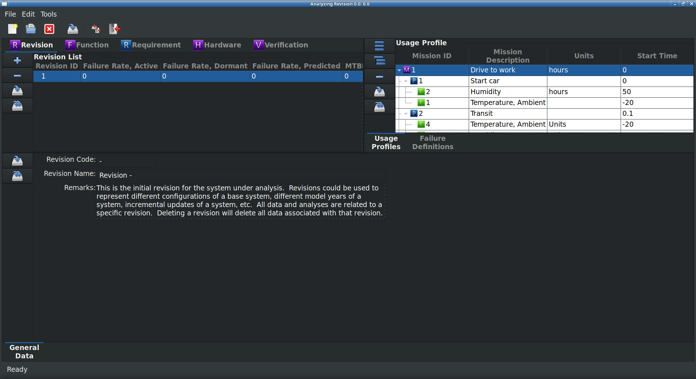

***************
RAMSTK Overview
***************

Getting Started
===============

The RAMSTK Conceptual Layout
----------------------------

RAMSTK is a multi-user, database-driven solution for reliability
program management and reliability analysis.  The use of a database provides
greater potential to integrate reliability program activities and tools, while
facilitating effective information sharing between engineers and engineering
teams.  Databases also provide greater security, auditability, and data
fidelity than the use of stand alone, single user, file format solutions.

However, for users making the transition from spreadsheets and other
single file solutions, there will be a learning curve.  ReliaQual Associates,
LLC doesn't believe the learning curve is steep, but some discussion of the
design of RAMSTK and terminology is in order to orient the new user.

RAMSTK works from a hierarchical or tree concept.  At the top of the
hierarchy is the RAMSTK Program.  The RAMSTK Program represents the database storing
the analysis data and results.  Each reliability program within an organization
would have it's own database and, thus, it's own RAMSTK Program.

At the next level in the hierarchy, an RAMSTK Program is comprised of
modules (For those familiar with databases, a module represents a view of a
single table or a JOIN query of multiple tables with related information.)
There are currently five modules available for RAMSTK.  These are:

* Revision
* Function
* Requirement
* Hardware
* Validation

Every RAMSTK Program must have a Revision module; the remainder are
optional.

Each module groups related data and analyses.  With the exception of
the Revision module, all the data and analyses are related to a single module.
A RAMSTK Program can have multiple Revision modules, but a Revision module can
only have one of each subordinate module.  Visually, the hierarchy of RAMSTK is::

  RAMSTK Program
    |
    +- Revision -
    |    |
    |    +- Function (for Revision -)
    |    +- Requirement (for Revision -)
    |    +- Hardware (for Revision -)
    |    +- Validation (for Revision -)
    +- Revision A.
         |
         +- Function (for Revision A)
         +- Requirement (for Revision A)
         +- Hardware (for Revision A)
         +- Validation (for Revision A)

Most RAMSTK modules will have additional information and analyses
associated with them.  Information and analyses related to each of the modules
are:

* Revision
  * Usage Profile
  * Failure Definition
* Function
  * Hazard Analysis
* Requirement
  * Stakeholder Inputs
* Hardware
  * Reliability Allocation
  * Similar Item Analysis
  * Reliability Assessment (Prediction)
  * (Design) Failure Mode, Effects, and (Criticality) Analysis (D)FME(C)A
  * Physics of Failure Analysis/Damage Modeling
* Validation

As you can see, the type of information and analyses under each RAMSTK
module are related to that module in their scope.  For example,

> Failure definitions are related to the Revision module because failures should
be defined early for the entire program and are applicable to all modules as
they are applicable throughout all phases of the program.

> Reliability allocations, predictions, etc. are related to the Hardware
module because they are analyzing the Hardware design.

Visually, including the information and analyses associated with each
module, the hierarchy of RAMSTK is::

  RAMSTK Program
    |
    +- Revision -
    |    |
    |    +- Usage Profile
    |    +- Failure Definition
    +- Function (for Revision -)
    |    |
    |    +- Hazard Analysis
    +- Requirement (for Revision -)
    |    |
    |    +- Stakeholder Inputs
    +- Hardware (for Revision -)
    |    |
    |    +- Allocation.
    |    +- Similar Item Analysis
    |    +- Reliability Assessment (Prediction)
    |    +- (Design) Failure Mode, Effects, and (Criticality) Analysis (D)FME(C)A
    |    +- Physics of Failure Analysis/Damage Modeling.
    +- Validation (for Revision -)

The RAMSTK Visual Layout
------------------------

The RAMSTK application is a graphical user interface (GUI) application only.
The base of the GUI is referred to as the Desktop.  On the Desktop, there
are three books.  The book in the upper left corner is referred to as the
Module Book.  The upper right corner book is the List & Matrices Book.  Along
the lower half of the Desktop is the Work Book.  :ref:`fig_ramstklayout` shows
the RAMSTK application after connecting to a Program Database.

.. _fig_ramstklayout:

   RAMSTK GUI Layout

Each of these Books are discussed in greater detail in the following sections.

The Module Book
^^^^^^^^^^^^^^^

The Module Book groups all of the RAMSTK work stream modules.  This book has a
page for each of the RAMSTK modules activated in the open RAMSTK Program.
The tabs, from left to right, generally follow the flow of a development
program.

In the Revision tab, the user would select the Revision they are interested in
working with.  This causes the information related to the selected Revision for
the other RAMSTK modules to be loaded.  Thus, the Functions listed on the
Function page in the Module Book are those functions related to the selected
Revision only.

Some RAMSTK modules display module information in a flat list (Revision
and Validation).  Others display module information in a hierarchical list
(Function, Requirement, and Hardware).

The Work Book
^^^^^^^^^^^^^

The Work Book is where the bulk of the data entry and analyses in RAMSTK
takes place.  The information and analyses displayed in the Work Book is the
information and analyses associated with the line item selected in the Module
Book.  For example, if the Hardware page is selected in the Module Book, the
information and analyses shown in the Work Book are associated with the line
selected in the Module Book's Hardware page.

All RAMSTK Modules will have a General Data page in their Work Book.  Each
module will have other Work Book pages as appropriate for the type of
information and analyses related to them.

In the Work Book, text fields that accept user input will be displayed with a
white background using normal weight font.  Text fields that display
calculated results will be displayed with a light blue background using bold
font.  The background color is a user-specific option and may be changed.

The List Book
^^^^^^^^^^^^^

The List Book contains the supporting information for the selected RAMSTK
module.  Lists may be flat such as Failure Definitions or hierarchical such
as the Usage Profile.

.. _sec-ramstk-configuration:

RAMSTK Configuration
--------------------

.. _sec-ramstk-site-configuration:

Site Configuration
^^^^^^^^^^^^^^^^^^

.. _sec-ramstk-user-configuration:

User Configuration
^^^^^^^^^^^^^^^^^^
