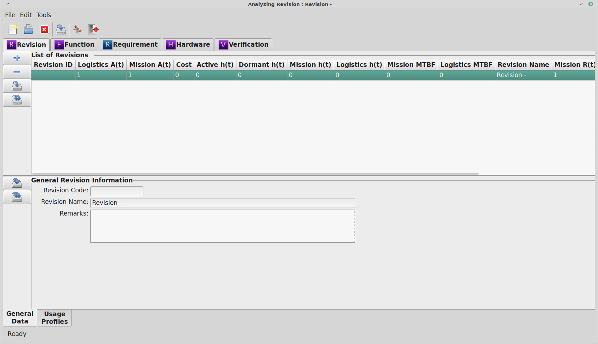

***************
RAMSTK Overview
***************

Getting Started
===============

The RAMSTK Conceptual Layout
----------------------------

RAMSTK is a multi-user, database-driven solution for reliability program
management and reliability analysis.  The use of a database provides greater
potential to integrate reliability program activities and tools, while
facilitating effective information sharing between engineers and engineering
teams.  Databases also provide greater security, auditability, and data
fidelity than the use of stand alone, single user, file format solutions.

However, for users making the transition from spreadsheets and other single
file solutions, there will be a learning curve.  ReliaQual Associates, LLC
doesn't believe the learning curve is steep, but some discussion of the
design of RAMSTK and terminology is in order to orient the new user.

RAMSTK works from a hierarchical or tree concept.  At the top of the
hierarchy is the RAMSTK Program.  The RAMSTK Program represents the database
storing the analysis data and results.  Each reliability program within an
organization would have it's own database and, thus, it's own RAMSTK Program.

At the next level in the hierarchy, an RAMSTK Program is comprised of modules
(For those familiar with databases, a module represents a view of a single
table or a JOIN query of multiple tables with related information.)  There are
currently five modules available for RAMSTK.  These are:

* Revision
* Function
* Requirement
* Hardware
* Validation & Verification

Every RAMSTK Program must have a Revision module; the remainder are optional.

Each module groups related data and analyses.  With the exception of the
Revision module, all the data and analyses are related to a single module.  A
RAMSTK Program can have multiple Revision modules, but a Revision module can
only have one of each subordinate module.  Visually, the hierarchy of RAMSTK
is::

  RAMSTK Program
    |
    +- Revision -
    |    |
    |    +- Function (for Revision -)
    |    +- Requirement (for Revision -)
    |    +- Hardware (for Revision -)
    |    +- Validation (for Revision -)
    +- Revision A.
         |
         +- Function (for Revision A)
         +- Requirement (for Revision A)
         +- Hardware (for Revision A)
         +- Validation (for Revision A)

Most RAMSTK modules will have additional information and analyses associated
with them.  Information and analyses related to each of the modules are:

* Revision

  * Usage Profile

* Function

  * Failure Definitions
  * Hazard Analysis

* Requirement

  * Stakeholder Inputs

* Hardware

  * Reliability Allocation
  * Similar Item Analysis
  * Reliability Assessment (Prediction)
  * (Design) Failure Mode, Effects, and (Criticality) Analysis (D)FME(C)A
  * Physics of Failure Analysis/Damage Modeling

* Validation

As you can see, the type of information and analyses under each RAMSTK module
are related to that module in their scope.  For example,

> Failure definitions are related to the Function module because failures should
be defined early for the entire program and are applicable to all modules as
they are applicable throughout all phases of the program.

> Reliability allocations, predictions, etc. are related to the Hardware
module because they are analyzing the Hardware design.

Visually, including the information and analyses associated with each module,
the hierarchy of RAMSTK is::

  RAMSTK Program
    |
    +- Revision -
    |    |
    |    +- Usage Profile
    +- Function (for Revision -)
    |    |
    |    +- Failure Definitions
    |    +- Hazard Analysis
    +- Requirement (for Revision -)
    |    |
    |    +- Stakeholder Inputs
    +- Hardware (for Revision -)
    |    |
    |    +- Allocation.
    |    +- Similar Item Analysis
    |    +- Reliability Assessment (Prediction)
    |    +- (Design) Failure Mode, Effects, and (Criticality) Analysis (D)FME(C)A
    |    +- Physics of Failure Analysis/Damage Modeling.
    +- Validation (for Revision -)

The RAMSTK Visual Layout
------------------------

The RAMSTK application is a graphical user interface (GUI) application only.
The base of the GUI is referred to as the Desktop.  On the Desktop, there
are two books.  The upper book is referred to as the Module Book.  The book in
the lower half of the Desktop is the Work Book.  :ref:`fig_ramstklayout` shows
the RAMSTK application after connecting to a Program Database.

.. _fig_ramstklayout:

   RAMSTK GUI Layout

These two Books are discussed in greater detail in the following sections.

The Module Book
^^^^^^^^^^^^^^^

The Module Book groups all of the RAMSTK work stream modules.  This book has a
page for each of the RAMSTK modules activated in the open RAMSTK Program.  The
tabs, from left to right, generally follow the flow of a development program.

In the Revision tab, the user would select the Revision they are interested
in working with.  This causes the information related to the selected
Revision for the other RAMSTK modules to be loaded.  Thus, the Functions
listed on the Function page in the Module Book are those functions related to
the selected Revision only.

Some RAMSTK modules display module information in a flat list (Revision and
Validation).  Others display module information in a hierarchical list
(Function, Requirement, and Hardware).

The Work Book
^^^^^^^^^^^^^

The Work Book is where the bulk of the data entry and analyses in RAMSTK
takes place.  The information and analyses displayed in the Work Book is the
information and analyses associated with the line item selected in the Module
Book.  For example, if the Hardware page is selected in the Module Book, the
information and analyses shown in the Work Book are associated with the line
selected in the Module Book's Hardware page.

All RAMSTK Modules will have a General Data page in their Work Book.  Each
module will have other Work Book pages as appropriate for the type of
information and analyses related to them.

In the Work Book, text fields that accept user input will be displayed with a
white background using normal weight font.  Text fields that display
calculated results will be displayed with a light blue background using bold
font.  The background color is a user-specific option and may be changed.

.. _sec-ramstk-backends:

RAMSTK Databases
----------------

RAMSTK uses two databases.  The first is referred to as the Site or Common
database.  This database is used to store information that would be,
generally, common to every development program.  For example, RPN
descriptions, failure mode ratios, manufacturer lists, etc.  It's possible to
have multiple Site databases, perhaps one for each product line or one for
each market sector.  Regardless of how you choose to configure your Site
databases, you'll need at least one Site database.

The second database is the Program database.  There is one Program database
for each development Program.  These databases contain all of the information
specific to a development program.

.. _sec-ramstk-configuration:

RAMSTK Configuration
--------------------

Various RAMSTK options and preferences are set using configuration files.  There
are two configuration files, the Site configuration file and the user
configuration file.  These are \*.toml files and can be hand edited although
RAMSTK provides assistants for interacting with them.  Each is discussed in
more detail in the following sections.

.. _sec-ramstk-site-configuration:

Site Configuration
^^^^^^^^^^^^^^^^^^

The Site configuration file (Site.toml) contains the database
connection information for the Site database.  This file is installed at
$PREFIX/share/RAMSTK.  Unless you have write access to this directory, you
won't be able to change the parameters.  The default installation PREFIX is
/usr/local.

Using the PREFIX= option when installing RAMSTK would allow you to install
shared files to a user-writable location.  This approach would allow you to
use multiple Site databases as discussed in section
:ref:`sec-ramstk-backends`.  Using multiple virtual environments would be the
recommended solution for this.

.. _sec-ramstk-user-configuration:

User Configuration
^^^^^^^^^^^^^^^^^^

The User configuration file (RAMSTK.toml) contains a multitude of variables
each user can set to control the look and layout of the GUI.  This also where
connection information for the RAMSTK Program database server is saved.  This
file is installed at $HOME/.config/RAMSTK whenever RAMSTK is launched and
can't find RAMSTK.toml at this path.

The default RAMSTK.toml is shown below:

.. code-block:: toml

   title: "RAMSTK User Configuration"

   [general]
   reportsize = "letter"
     # paper size for generated reports
     # possible values: "letter", "a4"
   frmultiplier = "1000000.0"
     # the multiplier for display failure rate
     # possible values: any float value
   calcreltime = "100.0"
     # the time at which reliability is calculated
     # possible values: any float value
   decimal = "6"
     # the number of decimal places to display
     # possible values: any integer value
   modesource = "1"
     # the source of component failure modes
     # possible values: any integer value
   moduletabpos = "top"
     # the postion of the tabs in the module book
     # possible values: "bottom", "left", "right", "top"
   worktabpos = "bottom"
     # the position of the tabs in the work book
     # possible values: "bottom", "left", "right", "top"
   loglevel = "INFO"
     # the level of messages to log while running RAMSTK
     # possible values: "DEBUG", "ERROR", "INFO", "WARNING"

   [directories]
   datadir = "$HOME/.config/RAMSTK/layouts"
     # directory containing layout files for RAMSTK
     # possible values: any directory the user has read/write access
   icondir = "$HOME/.config/RAMSTK/icons"
     # directory containing the RAMSTK icons
     # possible values: any directory the user has read/write access
   logdir = "$HOME/.config/RAMSTK/logs"
     # directory where RAMSTK runtime logs are written
     # possible values: any directory the user has read/write access

   [layouts]
   allocation = "allocation.toml"
     # the name of the file containing Allocation tree layout information
     # possible values: any valid file name
   failure_definition = "failure_definition.toml"
     # the name of the file containing Failure Definition list layout information
     # possible values: any valid file name
   fmea = "fmea.toml"
     # the name of the file containing Failure Mode and Effects Analysis tree layout information
     # possible values: any valid file name
   function = "function.toml"
     # the name of the file containing Function tree layout information
     # possible values: any valid file name
   hardware = "hardware.toml"
     # the name of the file containing Hardware tree layout information
     # possible values: any valid file name
   hazard = "hazard.toml"
     # the name of the file containing Hazard Analysis tree layout information
     # possible values: any valid file name
   pof = "pof.toml"
     # the name of the file containing Physics of Failure analysis tree layout information
     # possible values: any valid file name
   requirement = "requirement.toml"
     # the name of the file containing Requirement tree layout information
     # possible values: any valid file name
   revision = "revision.toml"
     # the name of the file containing Revision list layout information.
     # possible values: any valid file name
   similar_item = "similar_item.toml"
     # the name of the file containing Similar Item tree layout information
     # possible values: any valid file name
   stakeholder = "stakeholder.toml"
     # the name of the file containing Stakeholder list layout information
     # possible values: any valid file name
   usage_profile = "usage_profile.toml"
     # the name of the file containing Usage Profile tree layout information
     # possible values: any valid file name
   validation = "validation.toml"
     # the name of the file containing Validation list layout information
     # possible values: any valid file name

   [colors]
   allocationbg = "#000000"
     # the background color of the Allocation analysis worksheet
     # possible values: any hexidecimal color code
   allocationfg = "#FFFFFF"
     # the foreground color of the Allocation analysis worksheet
     # possible values: any hexidecimal color code
   failure_definitionbg = "#000000"
     # the background color of the Failure Definition list
     # possible values: any hexidecimal color code
   failure_definitionfg = "#FFFFFF"
     # the foreground color of the Failure Definition list
     # possible values: any hexidecimal color code
   fmeabg = "#000000"
     # the background color of the Failure Mode and Effects Analysis worksheet
     # possible values: any hexidecimal color code
   fmeafg = "#FFFFFF"
     # the foreground color of the Failure Mode and Effects Analysis worksheet
     # possible values: any hexidecimal color code
   functionbg = "#000000"
     # the background color of the Function tree
     # possible values: any hexidecimal color code
   functionfg = "#FFFFFF"
     # the foreground color of the Function tree
     # possible values: any hexidecimal color code
   hardwarebg = "#000000"
     # the background color of the Hardware tree
     # possible values: any hexidecimal color code
   hardwarefg = "#FFFFFF"
     # the foreground color of the Hardware tree
     # possible values: any hexidecimal color code
   hazardbg = "#000000"
     # the background color of the Hazard analysis worksheet
     # possible values: any hexidecimal color code
   hazardfg = "#FFFFFF"
     # the foreground color of the Hazard analysis worksheet
     # possible values: any hexidecimal color code
   pofbg = "#000000"
     # the background color of the Physics of Failure analysis worksheet
     # possible values: any hexidecimal color code
   poffg = "#FFFFFF"
     # the foreground color of the Physics of Failure analysis worksheet
     # possible values: any hexidecimal color code
   requirementbg = "#000000"
     # the background color of the Requirement tree
     # possible values: any hexidecimal color code
   requirementfg = "#FFFFFF"
     # the foreground color of the Requirement tree
     # possible values: any hexidecimal color code
   revisionbg = "#000000"
     # the background color of the Revision list
     # possible values: any hexidecimal color code
   revisionfg = "#FFFFFF"
     # the foreground color of the Revision list
     # possible values: any hexidecimal color code
   similar_itembg  = "#000000"
     # the background color of the Similar Item analysis worksheet
     # possible values: any hexidecimal color code
   similar_itemfg = "#FFFFFF"
     # the foreground color of the Similar Item analysis worksheet
     # possible values: any hexidecimal color code
   stakeholderbg  = "#000000"
     # the background color of the Stakeholder input list
     # possible values: any hexidecimal color code
   stakeholderfg = "#FFFFFF"
     # the foreground color of the Stakeholder input list
     # possible values: any hexidecimal color code
   validationbg  = "#000000"
     # the background color of the Validation & Verification task list
     # possible values: any hexidecimal color code
   validationfg = "#FFFFFF"
     # the foreground color of the Validation & Verification task list
     # possible values: any hexidecimal color code
