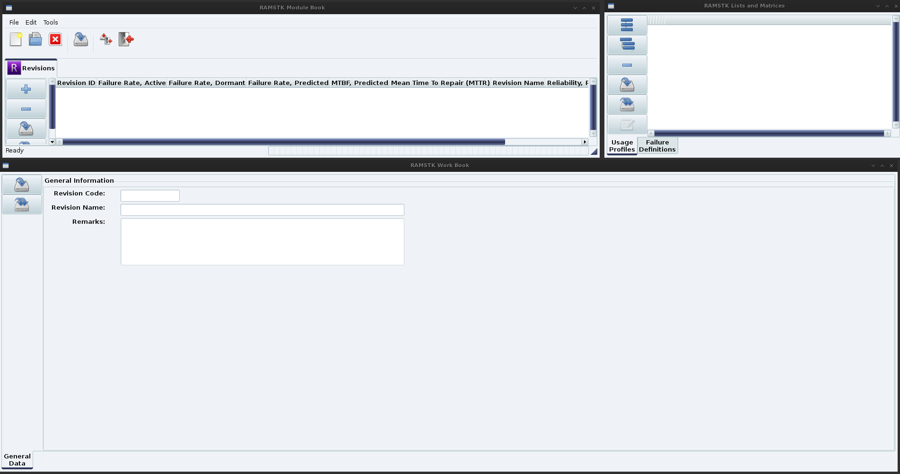

# Installing RAMSTK

RAMSTK is available via PyPi and can be installed on a Linux machine using one of the following commands:

```sh
$ pip install RAMSTK
```

On Windows, the exe or msi installer must be downloaded and executed.

Once the RAMSTK application is installed, it may be launched from the
desktop icon, menu entry, or a shell.  On first launch, RAMSTK should detect first
run status, setup some user-specific configurations, and copy system-wide
configuration files into the user's profile.  Simply follow the prompts,
selecting default options if unsure.

# Getting Started

## The RAMSTK Conceptual Layout

RAMSTK is a multi-user, database-driven solution for reliability
program management and reliability analysis.  The use of a database provides
greater potential to integrate reliability program activities and tools, while
facilitating effective information sharing between engineers and engineering
teams.  Databases also provide greater security, auditability, and data
fidelity than the use of stand alone, single user, file format solutions.

However, for users making the transition from spreadsheets and other
single file solutions, there will be a learning curve.  ReliaQual Associates,
LLC doesn't believe the learning curve is steep, but some discussion of the
design of RAMSTK and terminology is in order to orient the new user.

RAMSTK works from a hierarchical or tree concept.  At the top of the
hierarchy is the RAMSTK Program.  The RAMSTK Program represents the database storing
the analysis data and results.  Each reliability program within an organization
would have it's own database and, thus, it's own RAMSTK Program.

At the next level in the hierarchy, an RAMSTK Program is comprised of
modules (For those familiar with databases, a module represents a view of a
single table or a JOIN query of multiple tables with related information.)
There are currently five modules available for RAMSTK.  These are:

* Revision
* Function
* Requirement
* Hardware
* Validation

Every RAMSTK Program must have a Revision module; the remainder are
optional.

Each module groups related data and analyses.  With the exception of
the Revision module, all the data and analyses are related to a single module.
A RAMSTK Program can have multiple Revision modules, but a Revision module can
only have one of each subordinate module.  Visually, the hierarchy of RAMSTK is:

- RAMSTK Program
  * Revision -
    + Function (for Revision -)
    + Requirement (for Revision -)
    + Hardware (for Revision -)
    + Validation (for Revision -)
  * Revision A.
    + Function (for Revision A)
    + Requirement (for Revision A)
    + Hardware (for Revision A)
    + Validation (for Revision A)

Most RAMSTK modules will have additional information and analyses
associated with them.  Information and analyses related to each of the modules
are:

* Revision
  + Usage Profile
  + Failure Definition
* Function
  + Hazard Analysis
* Requirement
  + Stakeholder Inputs
* Hardware
  + Reliability Allocation
  + Similar Item Analysis
  + Reliability Assessment (Prediction)
    - MIL-HDBK-217FN2, Part Count
    - MIL-HDBK-217FN2, Part Stress
  + (Design) Failure Mode, Effects, and (Criticality) Analysis (D)FME(C)A
  + Physics of Failure Analysis/Damage Modeling
* Validation

As you can see, the type of information and analyses under each RAMSTK
module are related to that module in their scope.  For example,

> Failure definitions are related to the Revision module because failures should
be defined early for the entire program and are applicable to all modules as
they are applicable throughout all phases of the program.

> Reliability allocations, predictions, etc. are related to the Hardware
module because they are analyzing the Hardware design.

Visually, including the information and analyses associated with each
module, the hierarchy of RAMSTK is:

* RAMSTK Program
  + Revision -
    - Usage Profile
    - Failure Definition
    - Function (for Revision -)
      * Hazard Analysis
    - Requirement (for Revision -)
      * Stakeholder Inputs
    - Hardware (for Revision -)
      * Allocation.
      * Similar Item Analysis
      * Reliability Assessment (Prediction)
      * (Design) Failure Mode, Effects, and (Criticality) Analysis (D)FME(C)A
      * Physics of Failure Analysis/Damage Modeling.
    - Validation (for Revision -)

## The RAMSTK Visual Layout

The RAMSTK application is a graphical user interface (GUI) application only.
  The base of the GUI is referred to as the Desktop.  On the Desktop, there
   are three books.  The book in the upper left corner is referred to as the
    Module Book.  The upper right corner book is the List & Matrices Book
    .  Along the lower half of the Desktop is the Work Book.  [Figure 1
    ](#ramstklayout) shows the RAMSTK application after connecting to a Program
     Database.


<a name="ramstklayout"></a>

Each of these Books are discussed in greater detail in the following sections.

### The Module Book
<a name="modulebook"></a>

The Module Book groups all of the RAMSTK work stream modules.  This book has a
page for each of the RAMSTK modules activated in the open RAMSTK Program
.  The tabs, from left to right, generally follow the flow of a development
program.

In the Revision tab, the user would select the Revision they are interested in
working with.  This causes the information related to the selected Revision for
the other RAMSTK modules to be loaded.  Thus, the Functions listed on the
Function page in the Module Book are those functions related to the selected
Revision only.

Some RAMSTK modules display module information in a flat list (Revision
and Validation).  Others display module information in a hierarchical list
(Function, Requirement, and Hardware).

### The Work Book
<a name="workbook"></a>

The Work Book is where the bulk of the data entry and analyses in RAMSTK takes
 place.  The information and analyses displayed in the Work Book is the
 information and analyses associated with the line item selected in the Module
 Book.  For example, if the Hardware page is selected in the Module Book, the
 information and analyses shown in the Work Book are associated with the line
 selected in the Module Book's Hardware page.

All RAMSTK Modules will have a General Data page in their Work Book.
Each module will have other Work Book pages as appropriate for the type of
information and analyses related to them.

In the Work Book, text fields that accept user input will be
displayed with a white background using normal weight font.  Text fields that
display calculated results will be displayed with a light blue background using
bold font.  The background color is a user-specific option and may be changed.

### The Lists and Matrices Book
<a name="listbook"></a>

The Lists & Matrices Book contains the supporting information for the selected
RAMSTK module.  Lists may be flat such as Failure Definitions or hierarchical
such as the Usage Profile.

The Matrices are used to show relationships between the selected RAMSTK
Module and other RAMSTK Modules.  Matrices will show the items in the selected
RAMSTK Module along the left side (rows).  The other RAMSTK Module items are
listed along the top (columns).  In the intersection of the row and column, the
user may select 'Partial' or 'Complete' to indicate the strength of the
relationship.  Selecting nothing would indicate a lack of relationship.  Each
Matrix will have its own page in the Lists & Matrices Book and there may be
 multiple matrices for a selected RAMSTK Module.

For example, if the Module Book Function page is selected, the Lists
& Matrices Book will have a page displaying Functions along the left side
(rows) and Verification tasks along the top (columns).  Selecting 'Partial' in
the intersection of a Function and Verification task indicates the Verification
task partially verifies the function while selecting 'Complete' indicates the
task completely verifies the function.  If nothing is selected, this would
indicate a lack of a Verification task for that Function.  Cells with no
relationship are shown in white, partial cells are shown in pink, and complete
cells are shown in green.  This provides a quick visual representation of the
Verification plan as it is related to the system's Functions.

The

* Function
  + Function-Requirement
  + Function-Hardware
  + Function-Validation
* Requirement
  + Requirement-Hardware
  + Requirement-Validation
* Hardware
  + Hardware-Validation

# The RAMSTK Modules

This chapter describes each of the RAMSTK modules in detail.

## The Revision Module

The Revision Module is the only RAMSTK module **required** to be
used.  All other RAMSTK modules are optional and are relative to the Revision
module.

A Revision could be used to represent many things depending on your industry.  A Revision could be a:

* Model Year
* Configuration
* Variant

As mentioned above, the Revision Module Work Book only has a General
Data page where the following information is available for editing for the
selected Revision:

* Name
* Description
* Remarks

There are no analyses associated with the Revision Module.  Support
information associated with a Revision includes Usage Profiles and Failure
Definitions.  Each is discussed in greater detail in the next two sections.

### Usage Profile

The Usage Profile describes the tasks, durations, and environments in
which the system being developed is expected to perform each mission.  Without
a Usage Profile, reliability specifications and analyses have no real meaning.

The Usage Profile(s) should be defined and documented early in the
development program.  Each mission can be broken down into one or more mission
phase.  For each mission phase, one or more environmental conditions can be
defined.  A simple usage profile, for example, might be:

* Drive to work (Mission)
  + Start car (Mission Phase)
    - Temperature, Ambient (Environment)
    - Humidity
  + Transit from home to work (Mission Phase)
    - Temperature, Ambient
    - Humidity
    - Precipitation
    - Vibration
    - Shock
  + Stop car (Mission Phase)
    - Temperature, Ambient
    - Humidity
    - Precipitation

In the Usage Profile module, the following information is editable
for each entity:


| **Entity**        | **Attribute**                             |
| ----------------- | ----------------------------------------- |
| **Mission**       | Mission description                       |
|                   | Mission start time                        |
|                   | Mission end time                          |
| **Mission Phase** | Mission phase code                        |
|                   | Mission phase description                 |
|                   | Mission phase start time                  |
|                   | Mission phase end time                    |
| **Environment**   | Environmental condition description       |
|                   | Environmental condition measurement units |
|                   | Minimum design value                      |
|                   | Maximum design value                      |
|                   | Mean design value                         |
|                   | Variance of design value                  |

In addition to defining the usage profile, the mission and mission
phase will be used in Hardware FMECA's to calculate a failure mode's mission
time.

### Failure Definitions

Failure definitions should be developed and agreed upon early in the
development program.  These failure definitions should be used throughout the
entire life-cycle of the product.  It is best to define failures as the
functions are being defined.  Functional failure definitions will fall into one
of the following categories:

1. Too much function.
2. Too little function.
3. Intermittent functionality.
4. Function not there when required.
5. Function present when not required.

As requirements/specifications are identified these functional
failure definitions can be amended with performance values or new,
performance-based failure definitions can be added.

## The Function Module
### Hazards Analysis (HazOp)
## The Requirement Module
### Stakeholder Inputs
## The Hardware Module
### Reliability Allocation
### Similar Item Analysis
### Reliability Assessment
### (Design) Failure Mode, Effects, (and Criticality) Analysis [(D)FME(C)A]

RAMSTK supports both the MIL-STD-1629A, Task 102 approach to risk
categorization as well as the risk priority number (RPN) approach.

### Physics of Failure (PoF) Analysis/Damage Modeling
## The Validation Module
