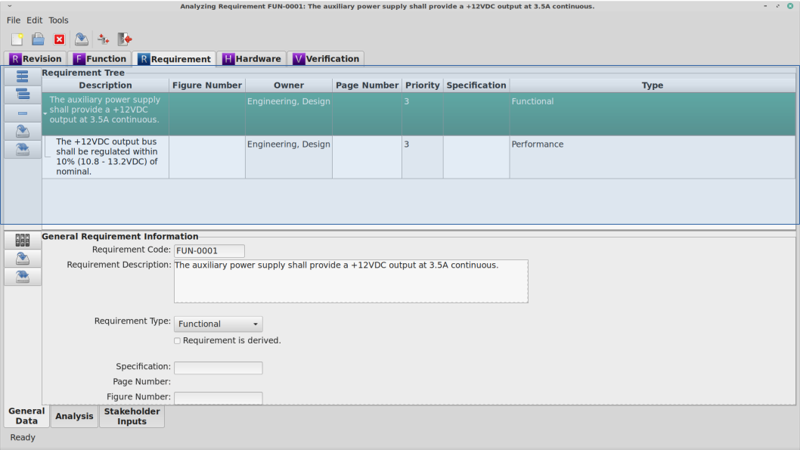
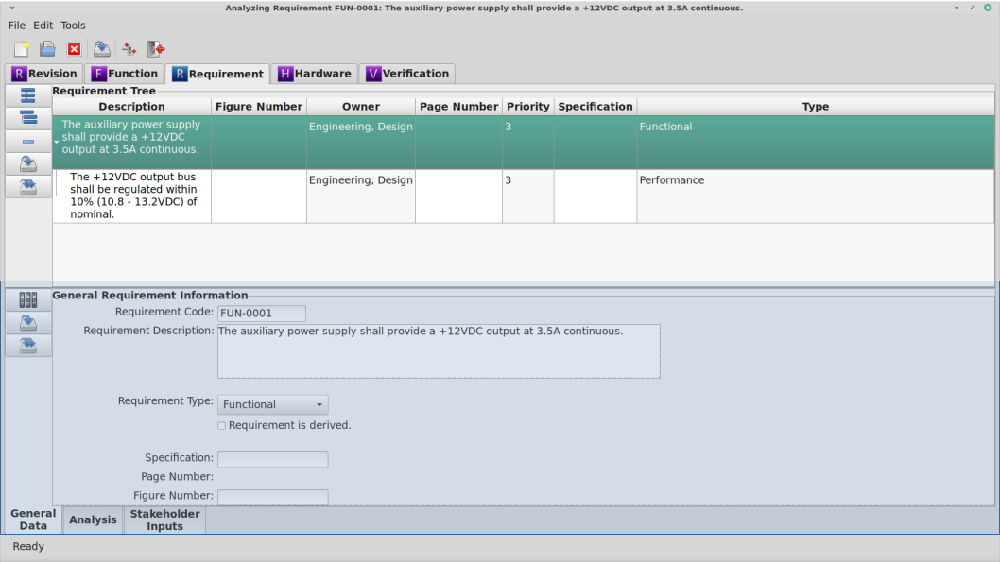

.. _sec-requirement:

Requirement Module
==================

The Requirement Module is the used to document and analyze the requirements of a
system.  While any or all requirements for a system could be documented in
`RAMSTK`, the intended use-case for the Requirement module is to document the
RAMS requirements only.

.. _sec-requirement-module-book:

Module Book
-----------

When the Requirement tab is selected in the Module Book, a hierarchical tree of
all the Requirements associated with the selected Revision is displayed.  The
attributes displayed for each Requirement are determined by the settings in the
:ref:`sec-ramstk-user-configuration` file.  The following attributes are
available for display in the Requirement tab of the Module Book.

.. tabularcolumns:: |r|l|l|
.. table:: **Requirement Attributes Available to Module Book**

   +-----------------------------+----------+----------------------------------+
   | Attribute                   | Editable | Source of Data                   |
   +=============================+==========+==================================+
   | Revision ID                 | No       | Assigned by database.            |
   +-----------------------------+----------+----------------------------------+
   | Requirement ID              | No       | Assigned by database.            |
   +-----------------------------+----------+----------------------------------+
   | Derived                     | Yes      | Check button.                    |
   +-----------------------------+----------+----------------------------------+
   | Requirement Description     | Yes      | Free form entry.                 |
   +-----------------------------+----------+----------------------------------+
   | Requirement Owner           | Yes      | Pick list stored in Site         |
   |                             |          | database.                        |
   +-----------------------------+----------+----------------------------------+
   | Applicable Specification    | Yes      | Free form entry.                 |
   +-----------------------------+----------+----------------------------------+
   | Specification Page Number   | Yes      | Free form entry.                 |
   +-----------------------------+----------+----------------------------------+
   | Specification Figure Number | Yes      | Free form entry.                 |
   +-----------------------------+----------+----------------------------------+
   | Parent ID                   | No       | Assigned by database.            |
   +-----------------------------+----------+----------------------------------+
   | Priority                    | Yes      | Pick list.                       |
   +-----------------------------+----------+----------------------------------+
   | Requirement Code            | Yes      | Free form entry.                 |
   +-----------------------------+----------+----------------------------------+
   | Requirement Type            | Yes      | Pick list stored in Site         |
   |                             |          | database.                        |
   +-----------------------------+----------+----------------------------------+
   | Validated                   | Yes      | Check button.                    |
   +-----------------------------+----------+----------------------------------+
   | Validated Date              | Yes      | Free form entry.                 |
   +-----------------------------+----------+----------------------------------+
   | Clarity Question #1         | Yes      | Check button.                    |
   +-----------------------------+----------+----------------------------------+
   | Clarity Question #2         | Yes      | Check button.                    |
   +-----------------------------+----------+----------------------------------+
   | Clarity Question #3         | Yes      | Check button.                    |
   +-----------------------------+----------+----------------------------------+
   | Clarity Question #4         | Yes      | Check button.                    |
   +-----------------------------+----------+----------------------------------+
   | Clarity Question #5         | Yes      | Check button.                    |
   +-----------------------------+----------+----------------------------------+
   | Clarity Question #6         | Yes      | Check button.                    |
   +-----------------------------+----------+----------------------------------+
   | Clarity Question #7         | Yes      | Check button.                    |
   +-----------------------------+----------+----------------------------------+
   | Clarity Question #8         | Yes      | Check button.                    |
   +-----------------------------+----------+----------------------------------+
   | Clarity Question #9         | Yes      | Check button.                    |
   +-----------------------------+----------+----------------------------------+
   | Completeness Question #1    | Yes      | Check button.                    |
   +-----------------------------+----------+----------------------------------+
   | Completeness Question #2    | Yes      | Check button.                    |
   +-----------------------------+----------+----------------------------------+
   | Completeness Question #3    | Yes      | Check button.                    |
   +-----------------------------+----------+----------------------------------+
   | Completeness Question #4    | Yes      | Check button.                    |
   +-----------------------------+----------+----------------------------------+
   | Completeness Question #5    | Yes      | Check button.                    |
   +-----------------------------+----------+----------------------------------+
   | Completeness Question #6    | Yes      | Check button.                    |
   +-----------------------------+----------+----------------------------------+
   | Completeness Question #7    | Yes      | Check button.                    |
   +-----------------------------+----------+----------------------------------+
   | Completeness Question #8    | Yes      | Check button.                    |
   +-----------------------------+----------+----------------------------------+
   | Completeness Question #9    | Yes      | Check button.                    |
   +-----------------------------+----------+----------------------------------+
   | Completeness Question #10   | Yes      | Check button.                    |
   +-----------------------------+----------+----------------------------------+
   | Consistent Question #1      | Yes      | Check button.                    |
   +-----------------------------+----------+----------------------------------+
   | Consistent Question #2      | Yes      | Check button.                    |
   +-----------------------------+----------+----------------------------------+
   | Consistent Question #3      | Yes      | Check button.                    |
   +-----------------------------+----------+----------------------------------+
   | Consistent Question #4      | Yes      | Check button.                    |
   +-----------------------------+----------+----------------------------------+
   | Consistent Question #5      | Yes      | Check button.                    |
   +-----------------------------+----------+----------------------------------+
   | Consistent Question #6      | Yes      | Check button.                    |
   +-----------------------------+----------+----------------------------------+
   | Consistent Question #7      | Yes      | Check button.                    |
   +-----------------------------+----------+----------------------------------+
   | Consistent Question #8      | Yes      | Check button.                    |
   +-----------------------------+----------+----------------------------------+
   | Consistent Question #9      | Yes      | Check button.                    |
   +-----------------------------+----------+----------------------------------+
   | Verifiable Question #1      | Yes      | Check button.                    |
   +-----------------------------+----------+----------------------------------+
   | Verifiable Question #2      | Yes      | Check button.                    |
   +-----------------------------+----------+----------------------------------+
   | Verifiable Question #3      | Yes      | Check button.                    |
   +-----------------------------+----------+----------------------------------+
   | Verifiable Question #4      | Yes      | Check button.                    |
   +-----------------------------+----------+----------------------------------+
   | Verifiable Question #5      | Yes      | Check button.                    |
   +-----------------------------+----------+----------------------------------+
   | Verifiable Question #6      | Yes      | Check button.                    |
   +-----------------------------+----------+----------------------------------+

Selecting the Requirement you wish to work with from the displayed tree will
cause the Requirement module Work Book to display the attributes of the selected
Requirement.  This will also cause other work streams associated with the
Requirement module to load their attributes.

Adding and Removing Requirements from the Module Book
^^^^^^^^^^^^^^^^^^^^^^^^^^^^^^^^^^^^^^^^^^^^^^^^^^^^^
To add a new Requirement at the same indenture level as the currently selected
Requirement:

* Press the 'Add Sibling' button to the left of the requirement tree.
* Right click on the requirement tree and select 'Add Sibling' from the pop-up menu.

To add a new Requirement one indenture level lower than the currently selected
Requirement:

* Press the 'Add Child' button to the left of the requirement tree.
* Right click on the requirement tree and select 'Add Child' from the pop-up menu.

To remove the currently selected Requirement from the open `RAMSTK` Program
database:

* Press the 'Remove' button to the left of the requirement tree.
* Right click on the requirement tree and select 'Remove' from the pop-up menu.

You will be presented with a dialog confirming you want to delete the selected
Requirement and all associated data.  Associated data will include any
child (derived) requirements of the currently selected requirement.  Confirm
your intentions to complete the removal.

Saving Requirements from the Module Book
^^^^^^^^^^^^^^^^^^^^^^^^^^^^^^^^^^^^^^^^
To save changes to the currently selected Requirement:

* Press the 'Save' button to the left of the requirement tree.
* Right click on the requirement tree and select 'Save' from the pop-up menu.

All pending changes to the selected Requirement are committed to the open
`RAMSTK` Program database.

To save changes to all Requirements:

* Press the 'Save All' button to the left of the requirement tree.
* Right click on the requirement tree and select 'Save All' from the pop-up menu.

Pending changes to all Requirements associated with the selected Revision are
committed to the open `RAMSTK` Program database.

.. _sec-requirement-work-book:

Work Book
---------

The Requirement module Work Book has a General Data, Requirement Analysis,
and Stakeholder Input page.  The following attributes are displayed in the
Requirement's General Data page.

.. tabularcolumns:: |r|l|
.. table:: **Requirement Attributes in the Work Book**

   +-----------------------------+----------+----------------------------------+
   | Attribute                   | Editable | Source of Data                   |
   +=============================+==========+==================================+
   | Derived                     | Yes      | Check button.                    |
   +-----------------------------+----------+----------------------------------+
   | Requirement Description     | Yes      | Free form entry.                 |
   +-----------------------------+----------+----------------------------------+
   | Requirement Owner           | Yes      | Pick list stored in Site         |
   |                             |          | database.                        |
   +-----------------------------+----------+----------------------------------+
   | Applicable Specification    | Yes      | Free form entry.                 |
   +-----------------------------+----------+----------------------------------+
   | Specification Page Number   | Yes      | Free form entry.                 |
   +-----------------------------+----------+----------------------------------+
   | Specification Figure Number | Yes      | Free form entry.                 |
   +-----------------------------+----------+----------------------------------+
   | Priority                    | Yes      | Pick list.                       |
   +-----------------------------+----------+----------------------------------+
   | Requirement Code            | Yes      | Free form entry.                 |
   +-----------------------------+----------+----------------------------------+
   | Requirement Type            | Yes      | Pick list stored in Site         |
   |                             |          | database.                        |
   +-----------------------------+----------+----------------------------------+
   | Validated                   | Yes      | Check button.                    |
   +-----------------------------+----------+----------------------------------+
   | Validated Date              | Yes      | Free form entry.                 |
   +-----------------------------+----------+----------------------------------+

A requirement code is a unique identifier for a Requirement.  Requirement
codes can be automatically created by `RAMSTK` or you may enter them manually
if you have a coding scheme already defined.  `RAMSTK` will create the code
based on the requirement type and the requirement ID.  Each requirement type
has a three letter code.  The requirement ID is padded with leading zeros to
create a four digit number.  This number is appended to the requirement type
code, separated by a dash.  To automatically create the requirement code,
press the 'Create Code' button to the left of the work space.

.. important::
   Any existing code will be over written by the automatic code creation.

`RAMSTK` requirement types and their three letter codes are:

* Functional (FUN)
* Performance (PRF)
* Regulatory (REG)
* Reliability (REL)
* Safety (SAF)
* Serviceability (SVC)
* Usability (USE)

The requirement description is the Requirement itself.

If the requirement is a derived requirement, this should be indicated by
checking the derived check button.

If the requirement is driven by an industry, government, internal, etc.
specification, this can be documented in the specification field.  Further
detail can be entered in the page number and figure number fields.

The priority of the requirement is selected from the drop down menu.  The use
of 'shall', 'should', and 'may' are encouraged when defining the requirement
and these terms provide a level of prioritization.  The priority attribute
can be used to further refine prioritization if needed.

The group owning the requirement is selected from the drop down menu.

When the requirement is validated, this should be indicated by checking the
check button.  The date of validation can be manually entered in the
validated date field.  Next to this field is a button that will launch a date
selection dialog that can also be used to select the date.

The Analysis page, below, provides a set of criteria for analyzing the
quality of the selected requirement.

These criteria are grouped into four categories:

#. Requirement Clarity (9 questions)
#. Requirement Completeness (10 questions)
#. Requirement Consistency (9 questions)
#. Requirement Verifiability (6 questions)

These criteria are applicable to currently selected Requirement in the
requirement tree.  Ideally a requirement will satisfy each criterion in each
group.  In practice, that may not be possible for every requirement and you
should establish a minimum acceptable threshold such as 70% of the criteria
in each category being met.  You may choose to have some criteria mandatory
as well.

If a requirement doesn't meet the minimum criteria you establish, it should
be re-written until it does.  This may require negotiation with customer
organizations if they were the ones who levied the requirements.  Once a
requirement satisfies the minimum criteria, it can be considered validated.

See :ref:`sec-stakeholders` for instructions on working with the Stakeholders
work stream module.

Saving Requirements from the Work Book
^^^^^^^^^^^^^^^^^^^^^^^^^^^^^^^^^^^^^^
To save changes to the currently selected Requirement, press the 'Save' button
to the left of the work space.  All pending changes are committed to the
open `RAMSTK` Program database.

To save changes to all Requirements associated with the selected Revision, press
the 'Save All' button to the left of the work space.  Pending changes to all
Requirements are committed to the open `RAMSTK` Program database.

Analyzing the Requirement
-------------------------
There are no analyses associated with the Requirement module.
