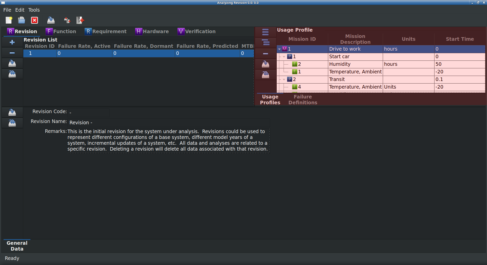

## The Revision Module

The Revision Module is the only RAMSTK module **required** to be
used.  All other RAMSTK modules are optional and are relative to the Revision
module.

A Revision could be used to represent many things depending on your industry.
 A Revision could represent:

* Model Year
* Configuration
* Variant

The Revision Module Work Book only has a General Data page where the following
information is available for editing for the selected Revision:

* Name
* Description
* Remarks

There are no analyses associated with the Revision Module.  Support
information associated with a Revision includes Usage Profiles and Failure
Definitions.  Each is discussed in greater detail in the next two sections.

### Usage Profile

The Usage Profile describes the tasks, durations, and environments in
which the system being developed is expected to perform each mission.  Without
a Usage Profile, reliability specifications and analyses have no real meaning.

The Usage Profile(s) should be defined and documented early in the
development program.  Each mission can be broken down into one or more mission
phases.  For each mission phase, one or more environmental conditions can be
defined.  A simple [usage profile](#usage_profile) (highlighted in red in
 the image), for example, might be:

* Drive to work (Mission)
  + Start car (Mission Phase)
    - Temperature, Ambient (Environment)
    - Humidity
  + Transit from home to work (Mission Phase)
    - Temperature, Ambient
    - Humidity
    - Precipitation
    - Vibration
    - Shock
  + Stop car (Mission Phase)
    - Temperature, Ambient
    - Humidity
    - Precipitation

In the Usage Profile module, the following information is editable
for each entity:

| **Entity**        | **Attribute**                             |
| ----------------- | ----------------------------------------- |
| **Mission**       | Mission description                       |
|                   | Mission start time                        |
|                   | Mission end time                          |
| **Mission Phase** | Mission phase code                        |
|                   | Mission phase description                 |
|                   | Mission phase start time                  |
|                   | Mission phase end time                    |
| **Environment**   | Environmental condition description       |
|                   | Environmental condition measurement units |
|                   | Minimum design value                      |
|                   | Maximum design value                      |
|                   | Mean design value                         |
|                   | Variance of design value                  |

In addition to defining the usage profile, the mission and mission
phase will be used in Hardware FMEA's to calculate a failure mode's mission
time.  Measurement units for environmental conditions and mission times are
stored in the RAMSTK Site database so a consistent set of units are available
for all RAMSTK Programs.  Design values for environmental conditions can be
defined as minimum, maximum, or using a mean and a variance.

### Failure Definitions

Failure definitions should be developed and agreed upon early in the
development program.  These failure definitions should be used throughout the
entire life-cycle of the product.  It is best to define failures as the
functions are being defined.  Functional failure definitions will fall into one
of the following categories:

1. Too much function.
2. Too little function.
3. Intermittent functionality.
4. Function not there when required.
5. Function present when not required.

As requirements/specifications are identified these functional
failure definitions can be amended with performance values or new,
performance-based failure definitions can be added.
