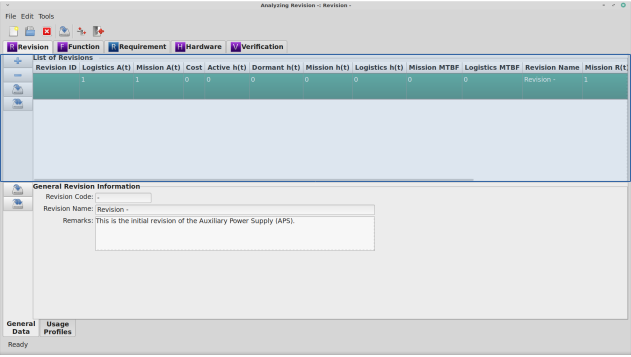

.. _sec-revision:

Revision Module
===============

The Revision module is the only `RAMSTK` module **required** to be used.  All
other `RAMSTK` modules are optional and are relative to the Revision module.  A
Revision could be used to represent many things depending on your needs.  A
Revision could represent:

* Revision
* Model Year
* Configuration
* Variant

It's certainly possible to have one `RAMSTK` Program database for each model
year, configuration, variant, etc. in which case there would only be one
Revision in each database.  Regardless of how you choose to structure your
work flow, a Revision represents a collection of work streams and their data
specific to that Revision.

Module Book
-----------

When the Revision tab is selected in the Module Book, a flat list of all the
Revisions associated with the open RAMSTK Program database is displayed.  The
attributes displayed for each Revision are determined by the settings in the
:ref:`sec-ramstk-user-configuration` file.  The following attributes are
available for display in the Revision tab of the Module Book.

.. tabularcolumns:: |r|l|
.. table:: **Revision Attributes Available to Module Book**

   +----------------------------------+----------+-----------------------------+
   | Attribute                        | Editable | Source of Data              |
   +==================================+==========+=============================+
   | Revision ID                      | No       | Assigned by database.       |
   +----------------------------------+----------+-----------------------------+
   | Predicted Availability           | No       | Calculated value.           |
   +----------------------------------+----------+-----------------------------+
   | Mission Availability             | No       | Calculated value.           |
   +----------------------------------+----------+-----------------------------+
   | Total Cost                       | No       | Calculated value.           |
   +----------------------------------+----------+-----------------------------+
   | Active Failure Rate              | No       | Calculated value.           |
   +----------------------------------+----------+-----------------------------+
   | Dormant Failure Rate             | No       | Calculated value.           |
   +----------------------------------+----------+-----------------------------+
   | Mission Failure Rate             | No       | Calculated value.           |
   +----------------------------------+----------+-----------------------------+
   | Predicted Failure Rate           | No       | Calculated value.           |
   +----------------------------------+----------+-----------------------------+
   | Software Failure Rate            | No       | Calculated value.           |
   +----------------------------------+----------+-----------------------------+
   | Mean Maintenance Time            | No       | Calculated value.           |
   +----------------------------------+----------+-----------------------------+
   | Mean Corrective Maintenance Time | No       | Calculated value.           |
   +----------------------------------+----------+-----------------------------+
   | Mean Predictive Maintenance Time | No       | Calculated value.           |
   +----------------------------------+----------+-----------------------------+
   | Mission MTBF                     | No       | Calculated value.           |
   +----------------------------------+----------+-----------------------------+
   | Predicted MTBF                   | No       | Calculated value.           |
   +----------------------------------+----------+-----------------------------+
   | Mean Time to Repair              | No       | Calculated value.           |
   +----------------------------------+----------+-----------------------------+
   | Revision Name                    | Yes      | Free form entry.            |
   +----------------------------------+----------+-----------------------------+
   | Mission Reliability              | No       | Calculated value.           |
   +----------------------------------+----------+-----------------------------+
   | Predicted Reliability            | No       | Calculated value.           |
   +----------------------------------+----------+-----------------------------+
   | Remarks                          | Yes      | Free form entry.            |
   +----------------------------------+----------+-----------------------------+
   | Revision Code                    | Yes      | Free form entry.            |
   +----------------------------------+----------+-----------------------------+

Selecting the Revision you wish to work with from the displayed list will
load the other work stream modules with their revision-specific data.  This
will also cause the Revision module Work Book to display the attributes of
the selected Revision.

Adding and Removing Revisions from the Module Book
^^^^^^^^^^^^^^^^^^^^^^^^^^^^^^^^^^^^^^^^^^^^^^^^^^
To add a new Revision to the open `RAMSTK` Program database:

* Press the 'Add' button to the left of the revision list.
* Right click on the revision list and select 'Add' from the pop-up menu.

To remove the currently selected Revision from the open `RAMSTK` Program
database:

* Press the 'Remove' button to the left of the revision list.
* Right click on the revision list and select 'Remove' from the pop-up menu.

You will be presented with a dialog confirming you want to delete the selected
Revision and all associated data.  This includes all the revision-specific
data for every work stream as well.  Confirm your intentions to complete the
removal.

Saving Revisions from the Module Book
^^^^^^^^^^^^^^^^^^^^^^^^^^^^^^^^^^^^^
To save changes to the currently selected Revision:

* Press the 'Save' button to the left of the revision list.
* Right click on the revision list and select 'Save' from the pop-up menu.

All pending changes to the currently selected Revision are committed to the
open `RAMSTK` Program database.

To save changes to all Revisions:

* Press the 'Save All' button to the left of the revision list.
* Right click on the revision list and select 'Save All' from the pop-up menu.

Pending changes to all Revisions are committed to the open `RAMSTK` Program
database.

Work Book
---------
.. figure:: ./figures/revision_work_book.png

The Revision module Work Book only has a General Data page.  The
following attributes are displayed in the Revision's General Data page.

.. tabularcolumns:: |r|l|
.. table:: **Revision Attributes in the Work Book**

   +----------------------+----------+------------------------------------+
   | Attribute            | Editable | Source of Data                     |
   +======================+==========+====================================+
   | Revision Code        | Yes      | Free form entry.                   |
   +----------------------+----------+------------------------------------+
   | Revision Name        | Yes      | Free form entry.                   |
   +----------------------+----------+------------------------------------+
   | Remarks              | Yes      | Free form entry.                   |
   +----------------------+----------+------------------------------------+

The revision code is used as identifier for a specific Revision.  The coding
scheme is defined by you depending on your concept of a revision.  The table
below has some examples of revision codes for different revision concepts.

.. tabularcolumns:: |r|l|
.. table:: **Revision Concept Example Codes**

   +------------------+------------------------+
   | Revision Concept | Example Revision Codes |
   +==================+========================+
   | Revision         | \-                     |
   |                  +------------------------+
   |                  | A                      |
   |                  +------------------------+
   |                  | B                      |
   +------------------+------------------------+
   | Model Year       | MY2018                 |
   |                  +------------------------+
   |                  | MY2019                 |
   |                  +------------------------+
   |                  | MT2020                 |
   +------------------+------------------------+
   | Configuration    | PN1401.101             |
   |                  +------------------------+
   |                  | PN1401.101-1           |
   |                  +------------------------+
   |                  | PN1401.101-2           |
   +------------------+------------------------+
   | Variant          | ICV                    |
   |                  +------------------------+
   |                  | MGS                    |
   |                  +------------------------+
   |                  | ESV                    |
   +------------------+------------------------+

The revision name is a description of the Revision.  Enter a meaningful name
or description in this field.  For example, using the variant concept, the
names of each revision above would be Infantry Carrier Vehicle, Mobile Gun
System, Engineer Squad Vehicle.

Remarks can be entered in the revision remarks field.

Saving Revisions from the Work Book
^^^^^^^^^^^^^^^^^^^^^^^^^^^^^^^^^^^
To save changes to the currently selected Revision, press the 'Save' button
to the left of the work space.  All pending changes are committed to the
open `RAMSTK` Program database.

To save changes to all Revisions, press the 'Save All' button to the left of
the work space.  All pending changes to all Revisions are committed to the
open `RAMSTK` Program database.

Analyzing the Revision
----------------------
There are no analyses associated with the Revision module.  The RAMS metrics
displayed with the Revision are the top-level (system) Hardware work stream
results.
