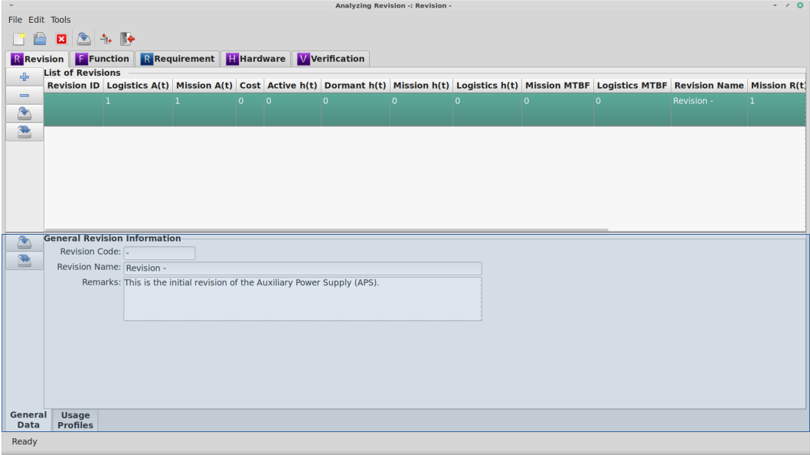

Revision Module
===============

The Revision module is the only `RAMSTK` module **required** to be used.  All
other `RAMSTK` modules are optional and are relative to the Revision module.  A
Revision could be used to represent many things depending on your needs.  A
Revision could represent:

* Model Year
* Configuration
* Variant

It's certainly possible to have one `RAMSTK` Program database for each model
year, configuration, variant, etc. in which case there would only be one
Revision in each database.  Regardless of how you choose to structure your
work flow, a Revision represents a collection of work streams and their data
specific to that Revision.

Module Book
-----------
.. figure:: ./figures/revision_module_book.png

When the Revision tab is selected in the Module Book, a flat list of all the
Revisions associated with the open RAMSTK Program database is displayed.  The
attributes displayed for each Revision are determined by the settings in the
:ref:`sec-ramstk-user-configuration` file.  The following attributes are
available for display in the Revision tab of the Module Book.

.. tabularcolumns:: |r|l|
.. table:: **Revision Attributes Available to Module Book**

   +----------------------------------+----------+
   | Attribute                        | Editable |
   +==================================+==========+
   | Revision ID                      | No       |
   +----------------------------------+----------+
   | Predicted Availability           | No       |
   +----------------------------------+----------+
   | Mission Availability             | No       |
   +----------------------------------+----------+
   | Total Cost                       | No       |
   +----------------------------------+----------+
   | Active Failure Rate              | No       |
   +----------------------------------+----------+
   | Dormant Failure Rate             | No       |
   +----------------------------------+----------+
   | Mission Failure Rate             | No       |
   +----------------------------------+----------+
   | Predicted Failure Rate           | No       |
   +----------------------------------+----------+
   | Software Failure Rate            | No       |
   +----------------------------------+----------+
   | Mean Maintenance Time            | No       |
   +----------------------------------+----------+
   | Mean Corrective Maintenance Time | No       |
   +----------------------------------+----------+
   | Mean Predictive Maintenance Time | No       |
   +----------------------------------+----------+
   | Mission MTBF                     | No       |
   +----------------------------------+----------+
   | Predicted MTBF                   | No       |
   +----------------------------------+----------+
   | Mean Time to Repair              | No       |
   +----------------------------------+----------+
   | Revision Name                    | Yes      |
   +----------------------------------+----------+
   | Mission Reliability              | No       |
   +----------------------------------+----------+
   | Predicted Reliability            | No       |
   +----------------------------------+----------+
   | Remarks                          | Yes      |
   +----------------------------------+----------+
   | Revision Code                    | Yes      |
   +----------------------------------+----------+

Selecting the Revision you wish to work with from the displayed list will
load the other work stream modules with their revision-specific data.  This
will also cause the Revision module Work Book to display the attributes of
the selected Revision.

Adding and Removing Revisions
^^^^^^^^^^^^^^^^^^^^^^^^^^^^^
To add a new Revision to the open `RAMSTK` Program database, press the 'Add'
button to the left of the revision list.

To remove the currently selected Revision from the open `RAMSTK` Program
database, press the 'Remove' button to the left of the revision list.  You
will be presented with a dialog confirming you want to delete the selected
Revision and all associated data.  This includes all the revision-specific
data for every work stream as well.  Confirm your intentions to complete the
removal.

Saving Revisions
^^^^^^^^^^^^^^^^
To save changes to the currently selected Revision, press the 'Save' button
to the left of the revision list.  All pending changes are committed to the
open `RAMSTK` Program database.

To save changes to all Revisions, press the 'Save All' button to the left of
the revision list.  All pending changes to all Revisions are committed to the
open `RAMSTK` Program database.

Work Book
---------

The Revision module Work Book only has a General Data page.  The
following attributes are displayed in the Revision's General Data page.

.. tabularcolumns:: |r|l|
.. table:: **Revision Attributes in the Work Book**

   +-------------+----------+
   | Attribute   | Editable |
   +=============+==========+
   | Name        | Yes      |
   +-------------+----------+
   | Description | Yes      |
   +-------------+----------+
   | Remarks     | Yes      |
   +-------------+----------+

Saving Revisions
^^^^^^^^^^^^^^^^
To save changes to the currently selected Revision, press the 'Save' button
to the left of the work space.  All pending changes are committed to the
open `RAMSTK` Program database.

To save changes to all Revisions, press the 'Save All' button to the left of
the work space.  All pending changes to all Revisions are committed to the
open `RAMSTK` Program database.

List & Matrices Book
--------------------
There are two lists associated with the Revision work stream.  These are the
:ref:`sec-usage-profile` and :ref:`sec-failure-definitions`.

There are no matrices associated with the Revision work stream.

Analyzing the Revision
----------------------
There are no analyses associated with the Revision module.  The RAMS metrics
displayed with the Revision are the top-level (system) Hardware work stream
results.
