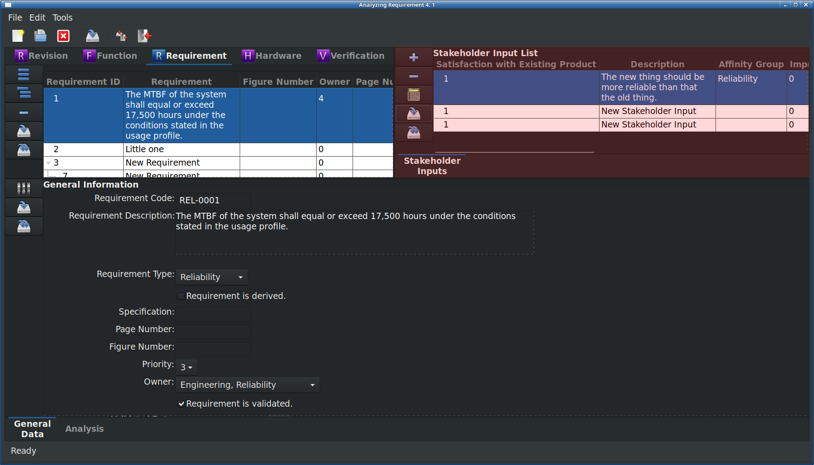

.. _sec-stakeholders:

Stakeholder Input Module
========================

Stakeholder inputs are inputs provided by internal and/or external
stakeholders; that is, the voice of the customer (VOC).  These inputs are
organized, analyzed, prioritized, and used to develop the engineering
requirements documented in the :ref:`sec-requirement`.

Module Book
-----------
Stakeholder inputs are unable to be displayed in the Module Book.

Work Book
---------
Stakeholder inputs are unable to be displayed in the Work Book.

List Book
---------
Stakeholder (customer) inputs, below, are captured in the list view.
Stakeholders can be internal, external, or both.  There are many sources for
stakeholder inputs.  It is recommended that list maintained in `RAMSTK` be a
living list and updated continuously.

The following attributes are available for display in the Stakeholder tab of
the List Book.

.. tabularcolumns:: |r|l|
.. table:: **Stakeholder Attributes Available to List Book**

   +-----------------------------------------+----------+
   | Attribute                               | Editable |
   +=========================================+==========+
   | Revision ID                             | No       |
   +-----------------------------------------+----------+
   | Input ID                                | No       |
   +-----------------------------------------+----------+
   | Satisfaction with Existing Product      | Yes      |
   +-----------------------------------------+----------+
   | Stakeholder Input                       | Yes      |
   +-----------------------------------------+----------+
   | Affinity Group                          | Yes      |
   +-----------------------------------------+----------+
   | Improvement Factor                      | No       |
   +-----------------------------------------+----------+
   | Overall Weighting                       | No       |
   +-----------------------------------------+----------+
   | Planned Satisfaction Rating             | Yes      |
   +-----------------------------------------+----------+
   | Priority                                | Yes      |
   +-----------------------------------------+----------+
   | Requirement ID                          | Yes      |
   +-----------------------------------------+----------+
   | Stakeholder                             | Yes      |
   +-----------------------------------------+----------+

Adding and Removing Stakeholder Inputs from the List Book
^^^^^^^^^^^^^^^^^^^^^^^^^^^^^^^^^^^^^^^^^^^^^^^^^^^^^^^^^
To add a new Stakeholder input:

* Press the 'Add' button to the left of the stakeholder input list.
* Right click on the stakeholder input tree and select 'Add' from the pop-up menu.

To remove the currently selected Stakeholder input from the open `RAMSTK`
Program database:

* Press the 'Remove' button to the left of the stakeholder input list.
* Right click on the stakeholder input list and select 'Remove' from the pop-up menu.

You will be presented with a dialog confirming you want to delete the selected
Stakeholder input and all associated data.  Confirm your intentions to
complete the removal.

Saving Stakeholder Inputs from the List Book
^^^^^^^^^^^^^^^^^^^^^^^^^^^^^^^^^^^^^^^^^^^^
To save changes to the currently selected Stakeholder input:

* Press the 'Save' button to the left of the stakeholder input list.
* Right click on the stakeholder input list and select 'Save' from the pop-up menu.

All pending changes to the selected Stakeholder input are committed to the open
`RAMSTK` Program database.

To save changes to all Stakeholder inputs:

* Press the 'Save All' button to the left of the stakeholder input list.
* Right click on the stakeholder input list and select 'Save All' from the pop-up menu.

Pending changes to all Stakeholder inputs associated with the selected Revision
are committed to the open `RAMSTK` Program database.

Analyzing Stakeholder Inputs
^^^^^^^^^^^^^^^^^^^^^^^^^^^^
At the beginning of a development program, all the stakeholder inputs
captured to date should be analyzed and used to develop engineering
requirements.  The purpose of this exercise is to ensure you develop a
product your customers actually want.

Using the default layout for Stakeholder inputs with all columns visible,
enter the following information:

#. The stakeholder's input.
#. The stakeholder's current satisfaction with the existing product's ability to satisfy the input from the previous step.  This is a value from 1 - 5, with 5 being the most satisfied.
#. The affinity group the input belongs to.  These are selected from a drop down menu.
#. The customer satisfaction rating the development team plans to achieve for the input.  This is a value from 1 - 5, with 5 being the most satisfied.
#. The priority the development team assigns to achieving the planned satisfaction rating for the given input.  This is selected from a drop down menu.
#. The stakeholder the input was elicited from.

Once the stakeholder input information is entered, press the 'Calculate'
button to the left of the stakeholder input list.  This will calculate the
improvement factors for the selected stakeholder input and update the
applicable fields in the stakeholder input list.
