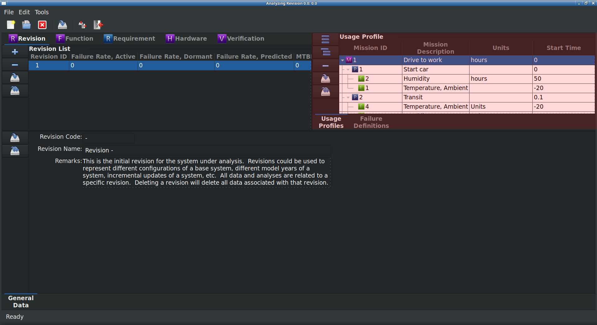

.. _sec-usage-profile:

Usage Profile
=============

The Usage Profile describes the tasks, durations, and environments in which
the system being developed is expected to perform each mission.  Without a
Usage Profile, reliability specifications and analyses have no real meaning.

The Usage Profile(s) should be defined and documented early in the
development program.  Each mission can be broken down into one or more mission
phases.  For each mission phase, one or more environmental conditions can be
defined.  A simple :ref:`fig-usage-profile` (highlighted in red), for example,
might be::

  Develop awesome new application (Mission)
    |
    +- Start computer (Mission Phase)
    |    |
    |    +- Temperature, Ambient (Environment)
    |    +- Humidity
    +- Write code, compile, and test (Mission Phase)
    |    |
    |    +- Temperature, Ambient
    |    +- Humidity
    |    +- Precipitation
    |    +- Vibration
    |    +- Shock
    +- Shutdown computer (Mission Phase)
         |
         +- Temperature, Ambient
         +- Humidity
         +- Precipitation

Module Book
-----------
The Usage Profile is unable to be displayed in the Module Book.

Work Book
---------
.. _fig-usage-profile:

   Usage Profile

The Usage Profile is displayed in the Work Book when the Revision work stream
is selected in the Module Book.  The following attributes are displayed for
each entity in the Usage Profile.  All attributes are editable.

.. tabularcolumns:: |r|l|
.. table:: **Usage Profile Attributes**

   +-------------------+----------------------+--------------------------------+
   | Entity            | Attribute            | Source of Data                 |
   +===================+======================+================================+
   | **Mission**       | Mission description  | Free form entry.               |
   |                   +----------------------+--------------------------------+
   |                   | Mission start time   | Free form entry.               |
   |                   +----------------------+--------------------------------+
   |                   | Mission end time     | Free form entry.               |
   +-------------------+----------------------+--------------------------------+
   | **Mission Phase** | Mission phase code   | Free form entry.               |
   |                   +----------------------+--------------------------------+
   |                   | Mission phase        | Free form entry.               |
   |                   | description          |                                |
   |                   +----------------------+--------------------------------+
   |                   | Mission phase start  | Free form entry.               |
   |                   | time                 |                                |
   |                   +----------------------+--------------------------------+
   |                   | Mission phase end    | Free form entry.               |
   |                   | time                 |                                |
   +-------------------+----------------------+--------------------------------+
   | **Environment**   | Environmental        | Free form entry.               |
   |                   | condition description|                                |
   |                   +----------------------+--------------------------------+
   |                   | Environmental        | Pick list stored in Site       |
   |                   | condition measurement| database.                      |
   |                   | units                |                                |
   |                   +----------------------+--------------------------------+
   |                   | Minimum design value | Free form entry.               |
   |                   +----------------------+--------------------------------+
   |                   | Maximum design value | Free form entry.               |
   |                   +----------------------+--------------------------------+
   |                   | Mean design value    | Free form entry.               |
   |                   +----------------------+--------------------------------+
   |                   | Variance of design   | Free form entry.               |
   |                   | value                |                                |
   +-------------------+----------------------+--------------------------------+

In addition to defining the usage profile, the mission and mission phase will
be used in Hardware FMEA's to calculate a failure mode's mission time.
Measurement units for environmental conditions and mission times are stored
in the `RAMSTK` Site database so a consistent set of units are available for
all `RAMSTK` Programs.  Design values for environmental conditions can be
defined as minimum, maximum, or using a mean and a variance.

Adding and Removing Usage Profile Entities
^^^^^^^^^^^^^^^^^^^^^^^^^^^^^^^^^^^^^^^^^^
The Usage Profile is hierachical with a mission being the top level.  Below
the mission are one or more mission phases.  For each mission phase one or
more environmental conditions can be defined.

When a new Revision is created in a RAMSTK Program database, including the
initial Revision, a basic Usage Profile consisting of a mission, mission
phase, and one environmental condition is also created.  To add an entity at
the same indenture level as the currently selected entity, press the 'Insert
Sibling' button to the left of the Usage Profile.

To add an entity one indenture level below the currently selected entity,
press the 'Insert Child' button to the left of the Usage Profile.  If the
currently selected entity is an environmental condition, this will raise a
dialog informing you that an environmental condition can't have a child.

To removed the currently selected entity, press the 'Remove' button to the
left of the Usage Profile.  You will be presented with a dialog confirming you
want to delete the selected entity and all associated data.  Confirm your
intentions to complete the removal.

Saving Usage Profiles
^^^^^^^^^^^^^^^^^^^^^
To save changes to the currently selected entity, press the 'Save' button to
the left of the Usage Profile.  All pending changes are committed to the open
`RAMSTK` Program database.

To save changes to all entities in all Usage Profiles, press the 'Save All'
button to the left of the Usage Profile.  All pending changes to all entities
are committed to the open `RAMSTK` Program database.

Analyzing the Usage Profile
---------------------------
There are no analyses associated with the Usage Profile.
