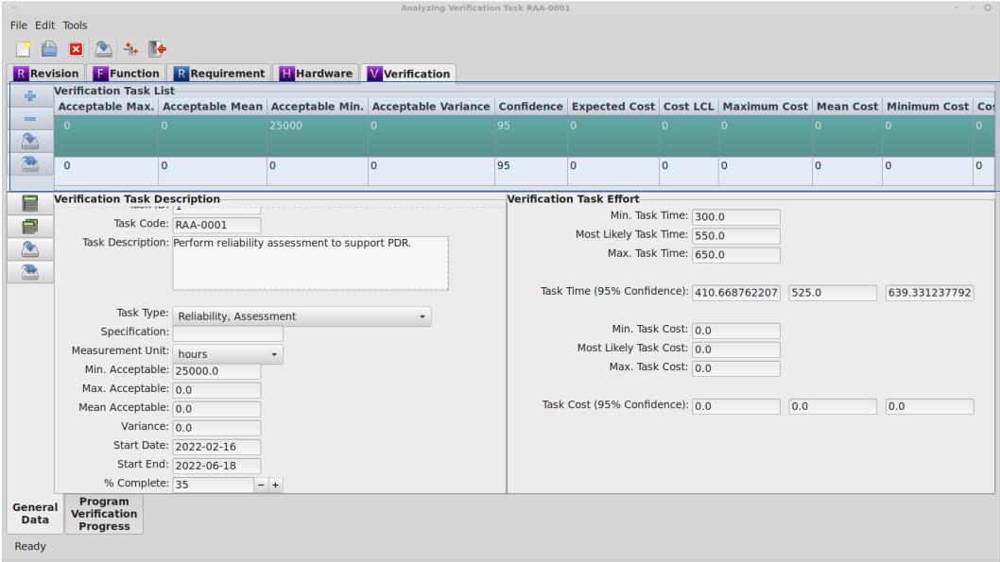
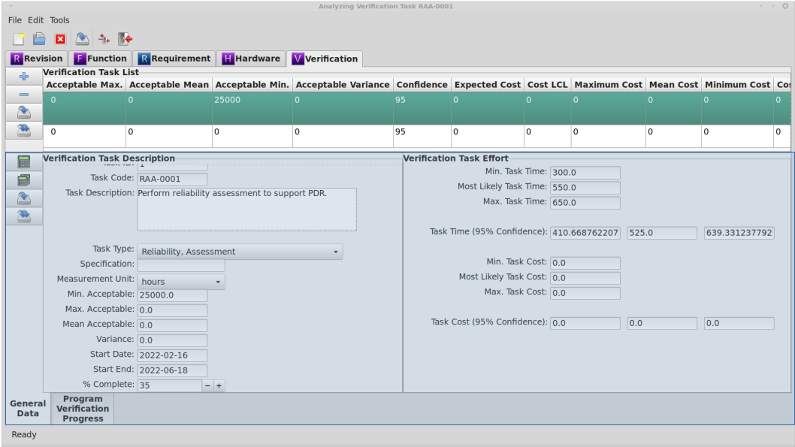

.. _sec-verification:

Verification Module
===================

The Verification module is used to document the development program's
verification plan.

.. _sec-verification-module-book:

Module Book
-----------

   :numref:`Verification Module Book`

When the Verification tab is selected in the Module Book, a list of all the
Verification tasks associated with the selected Revision is displayed.  The
attributes displayed for each Verification task are determined by the
settings in the :ref:`sec-ramstk-user-configuration` file.  The following
attributes are available for display in the Verification tab of the Module Book.

.. tabularcolumns:: |r|l|l|
.. table:: **Verification Attributes Available to Module Book**

   +---------------------------+----------+------------------------------------+
   | Attribute                 | Editable | Source of Data                     |
   +===========================+==========+====================================+
   | Revision ID               | No       | Assigned by database.              |
   +---------------------------+----------+------------------------------------+
   | Verification ID           | No       | Assigned by database.              |
   +---------------------------+----------+------------------------------------+
   | Maximum Acceptable Value  | Yes      | Free form entry.                   |
   | for Task Result           |          |                                    |
   +---------------------------+----------+------------------------------------+
   | Mean Acceptable Value for | Yes      | Free form entry.                   |
   | Task Result               |          |                                    |
   +---------------------------+----------+------------------------------------+
   | Minimum Acceptable Value  | Yes      | Free form entry.                   |
   | for Task Result           |          |                                    |
   +---------------------------+----------+------------------------------------+
   | Acceptable Variance for   | Yes      | Free form entry.                   |
   | Task Result               |          |                                    |
   +---------------------------+----------+------------------------------------+
   | Confidence Level for Task | Yes      | Free form entry.                   |
   | Time/Cost                 |          |                                    |
   +---------------------------+----------+------------------------------------+
   | Minimum Expected Task Cost| Yes      | Free form entry.                   |
   +---------------------------+----------+------------------------------------+
   | Average Expected Task Cost| Yes      | Free form entry.                   |
   +---------------------------+----------+------------------------------------+
   | Maximum Expected Task Cost| Yes      | Free form entry.                   |
   +---------------------------+----------+------------------------------------+
   | Task Cost Lower Confidence| No       | Calculated value.                  |
   | Limit                     |          |                                    |
   +---------------------------+----------+------------------------------------+
   | Mean Task Cost            | No       | Calculated value.                  |
   +---------------------------+----------+------------------------------------+
   | Task Cost Upper Confidence| No       | Calculated value.                  |
   | Limit                     |          |                                    |
   +---------------------------+----------+------------------------------------+
   | Variance of Task Cost     | Yes      | Free form entry.                   |
   +---------------------------+----------+------------------------------------+
   | Minimum Expected Task Time| Yes      | Free form entry.                   |
   +---------------------------+----------+------------------------------------+
   | Average Expected Task Time| Yes      | Free form entry.                   |
   +---------------------------+----------+------------------------------------+
   | Maximum Expected Task Time| Yes      | Free form entry.                   |
   +---------------------------+----------+------------------------------------+
   | Task Time Lower Confidence| No       | Calculated value.                  |
   | Limit                     |          |                                    |
   +---------------------------+----------+------------------------------------+
   | Mean Task Time            | No       | Calculated value.                  |
   +---------------------------+----------+------------------------------------+
   | Task Time Upper Confidence| No       | Calculated value.                  |
   | Limit                     |          |                                    |
   +---------------------------+----------+------------------------------------+
   | Task Time Variance        | Yes      | Free form entry.                   |
   +---------------------------+----------+------------------------------------+
   | Planned Start Date of Task| Yes      | Free form entry.                   |
   +---------------------------+----------+------------------------------------+
   | Planned End Date of Task  | Yes      | Free form entry.                   |
   +---------------------------+----------+------------------------------------+
   | Description of Task       | Yes      | Free form entry.                   |
   +---------------------------+----------+------------------------------------+
   | Unit of Measure for Task  | Yes      | Pick list stored in Site database. |
   | Results                   |          |                                    |
   +---------------------------+----------+------------------------------------+
   | Task Code                 | No       | Calculated value.                  |
   +---------------------------+----------+------------------------------------+
   | % Task Complete           | Yes      | Free form entry.                   |
   +---------------------------+----------+------------------------------------+
   | Specification Applicable  | Yes      | Free form entry.                   |
   | to Task                   |          |                                    |
   +---------------------------+----------+------------------------------------+
   | Type of Task              | Yes      | Pick list stored in Site database. |
   +---------------------------+----------+------------------------------------+

Selecting the Verification task you wish to work with from the displayed list
will cause the Verification module Work Book to display the attributes of the
selected Verification task.  This will also cause other work streams associated
with the Verification module to load their attributes.

Adding and Removing Verification Tasks from the Module Book
^^^^^^^^^^^^^^^^^^^^^^^^^^^^^^^^^^^^^^^^^^^^^^^^^^^^^^^^^^^
To add a new Verification task:

* Press the 'Add' button to the left of the verification task list.
* Right click on the verification task list and select 'Add' from the pop-up menu.

To remove the currently selected Verification task from the open `RAMSTK`
Program database:

* Press the 'Remove' button to the left of the verification task list.
* Right click on the verification task list and select 'Remove' from the pop-up menu.

You will be presented with a dialog confirming you want to delete the selected
verification task and all associated data.  Confirm your intentions to complete
the removal.

Saving Verification Tasks from the Module Book
^^^^^^^^^^^^^^^^^^^^^^^^^^^^^^^^^^^^^^^^^^^^^^
To save changes to the currently selected Verification task:

* Press the 'Save' button to the left of the verification task list.
* Right click on the verification task list and select 'Save' from the pop-up menu.

All pending changes to the selected Verification task are committed to the open
`RAMSTK` Program database.

To save changes to all Verification tasks:

* Press the 'Save All' button to the left of the verification task list.
* Right click on the verification task list and select 'Save All' from the pop-up menu.

Pending changes to all Verification tasks associated with the selected Revision
are committed to the open `RAMSTK` Program database.

.. _sec-verification-work-book:

Work Book
---------

   :numref:`Verification Work Book`

The Verification module Work Book has a General Data and a Program
Verification Progress page.  The following attributes are displayed in the
Verification's General Data page.

.. tabularcolumns:: |r|l|l|
.. table:: **Verification Attributes in the Work Book**

   +---------------------------+----------+------------------------------------+
   | Attribute                 | Editable | Source of Data                     |
   +===========================+==========+====================================+
   | Verification ID           | No       | Assigned by database.              |
   +---------------------------+----------+------------------------------------+
   | Verification Task Code    | No       | Calculated value.                  |
   +---------------------------+----------+------------------------------------+
   | Task Description          | Yes      | Free form entry.                   |
   +---------------------------+----------+------------------------------------+
   | Task Type                 | Yes      | Pick list stored in Site database. |
   +---------------------------+----------+------------------------------------+
   | Specification             | Yes      | Free form entry.                   |
   +---------------------------+----------+------------------------------------+
   | Measurement Units         | Yes      | Pick list stored in Site database. |
   +---------------------------+----------+------------------------------------+
   | Minimum Acceptable Value  | Yes      | Free form entry.                   |
   +---------------------------+----------+------------------------------------+
   | Maximum Acceptable Value  | Yes      | Free form entry.                   |
   +---------------------------+----------+------------------------------------+
   | Mean Acceptable Value     | Yes      | Free form entry.                   |
   +---------------------------+----------+------------------------------------+
   | Acceptable Variance       | Yes      | Free form entry.                   |
   +---------------------------+----------+------------------------------------+
   | Start Date                | Yes      | Free form entry.                   |
   +---------------------------+----------+------------------------------------+
   | End Date                  | Yes      | Free form entry.                   |
   +---------------------------+----------+------------------------------------+
   | % Complete                | Yes      | Free form entry.                   |
   +---------------------------+----------+------------------------------------+
   | Minimum Expected Task Time| Yes      | Free form entry.                   |
   +---------------------------+----------+------------------------------------+
   | Most Likely Expected Task | Yes      | Free form entry.                   |
   | Time                      |          |                                    |
   +---------------------------+----------+------------------------------------+
   | Maximum Expected Task Time| Yes      | Free form entry.                   |
   +---------------------------+----------+------------------------------------+
   | Estimated Task Time at    | No       | Calculated value.                  |
   | Confidence                |          |                                    |
   +---------------------------+----------+------------------------------------+
   | Minimum Expected Task Cost| Yes      | Free form entry.                   |
   +---------------------------+----------+------------------------------------+
   | Most Likely Expected Task | Yes      | Free form entry.                   |
   | Cost                      |          |                                    |
   +---------------------------+----------+------------------------------------+
   | Maximum Expected Task Cost| Yes      | Free form entry.                   |
   +---------------------------+----------+------------------------------------+
   | Estimated Task Cost at    | No       | Calculated value.                  |
   | Confidence                |          |                                    |
   +---------------------------+----------+------------------------------------+

The verification ID is the database identifier for the task.

A verification code is a unique identifier for a Verification task.
Verification codes are automatically created by `RAMSTK`.  `RAMSTK` creates
the code based on the verification task type and the verification task ID.
Each verification task type has a three letter code.  The verification task ID
is padded with leading zeros to create a four digit number.  This number is
appended to the verification task type code, separated by a dash.  The code
is automatically created when the task type is selected or changed.

.. important::
   Any existing code will be over written by the automatic code creation.

`RAMSTK` verification task types and their three letter codes are:

* Manufacturing Test, DOE (DOE)
* Manufacturing Test, ESS (ESS)
* Manufacturing Test, HASS (HSS)
* Manufacturing Test, PRAT (PRT)
* Reliability, Assessment (RAA)
* Reliability, Durability Analysis (RDA)
* Reliability, FFMEA (RFF)
* Reliability, (D)FMEA (RDF)
* Reliability, Root Cause Analysis (RCA)
* Reliability, Survival Analysis (RSA)
* Reliability Test, ALT (ALT)
* Reliability Test, Demonstration (RDT)
* Reliability Test, HALT (HLT)
* Reliability Test, Growth (RGT)
* Safety, Fault Tree Analysis (FTA)
* Safety, Hazards Analysis (PHA)
* System Engineering, Electromagnetic Analysis (EMA)
* System Engineering, FEA (FEA)
* System Engineering, 2D Model (2DM)
* System Engineering, 3D Model (3DM)
* System Engineering, Robust Design (SRD)
* System Engineering, Sneak Circuit Analysis (SCA)
* System Engineering, Thermal Analysis (THA)
* System Engineering, Tolerance Analysis (TOL)
* System Engineering, Worst Case Analysis (WCA)

Task Description is simply a description of the task to be performed.

Task Type is the type of task, from the list above, and is selected from the
drop down menu.

The specification is any applicable industry, government, internal, etc.
specification that governs the task.

For tasks that verify compliance with quantitative requirements, the
measurement units can be selected from the drop down menu.  There are two
methods for specifying compliance with the requirement.  You may use a
minimum/maximum or mean/variance.

If using a minimum and/or maximum value approach, enter the minimum and/or
maximum acceptable value(s) to show compliance with the requirement.  If
using the mean/variance approach, enter the acceptable mean value and
acceptable variance.  Although these values are for information only, the
mean/variance approach assumes *s*-normality.

Task status is determined by entering the planned start and finish dates.
The percent completion of the task should be updated periodically.  The start
date and end date are used to build the planned burn down curve.  Percent
completion of tasks are used to calculate the actual status of the
verification program for comparison with the plan.

To build the planned program burn down curve, you need to provide expected
task times.  Enter the minimum, most likely, and maximum times you expect the
task to take. These values are used to calculate the estimated task time.
This calculation uses the beta distribution to calculate a point estimate
along with two-sided, 95\% confidence level on the time.  Currently, the 95\%
confidence level is hard-coded.  These calculated values are displayed below
your entered values.

Similar to task time, the task cost is also calculated using a beta
distribution.  However, these values are only displayed in the verification
task work book.  Enter your estimated task costs in the fields provided.

Calculating Task Time and Cost from the Work Book
^^^^^^^^^^^^^^^^^^^^^^^^^^^^^^^^^^^^^^^^^^^^^^^^^
To calculate the estimated time and cost of the selected Verification task,
press the 'Calculate' button to the left of the work space.

To calculate the estimated time and cost of all Verification tasks (i.e.,
to calculate the plan) associated with the selected Revision, press the
'Calculate All' button to the left of the work space.

In addition to calculating all the Verification task times and costs, the
'Save All' button causes the overall remaining program time and cost, with
95\% confidence limits, to be calculated as well.  Overall program time and
cost are a function of the individual task times and costs as well as the \%
completion for each task.  These values are used on the Program Verification
Progress plot discussed below.

Saving Requirements from the Work Book
^^^^^^^^^^^^^^^^^^^^^^^^^^^^^^^^^^^^^^
To save changes to the currently selected Verification task, press the 'Save'
button to the left of the work space.  All pending changes are committed to the
open `RAMSTK` Program database.

To save changes to all Verification tasks associated with the selected
Revision, press the 'Save All' button to the left of the work space.  Pending
changes to all Verification tasks are committed to the open `RAMSTK` Program
database.

In addition to saving each individual Verification task, the 'Save All'
option also saves the remaining time and remaining cost of the verification
program to the `RAMSTK` Program database.  If there is no entry in the
database for the current date, one will be added.  If an entry exists, it
will be updated with the new remaining time and remaining cost.

Creating a Program Burn Down Curve
^^^^^^^^^^^^^^^^^^^^^^^^^^^^^^^^^^
When you select the Program Verification Progress page in the Verification
work book, you'll be presented with a blank plot.  Pressing the 'Plot' button
to the left of the work space will cause `RAMSTK` to calculate the
verification plan and plot the results.

   :numref:`Validation Program Status`

The plot shows the planned burn down curve which is the sum of the calculated
task times for each task that is planned to be in progress by date.  To make
this curve, `RAMSTK` assumes each task will be 0\% complete on the start date
and 100\% complete on the end date.  Progress occurs linearly over this
period.  For example, for a task that has a 20 day window, 5\% will be
completed each day.

The solid blue line shows the calculate mean program time.  The dashed green
and red lines show the 95\% lower and upper confidence limits, respectively, on
the estimated program time.  In the figure above, you can see the planned
curve is a summation of lines with inflection points at each date a task is
planned to close.  With only two tasks in the plan, these are particularly
noticeable.  As more tasks are added, this curve will take a more smoothed
appearance.

On the date(s) a task of type Reliability, Assessment is planned to close, a
vertical line is drawn.  This line is annotated with the maximum, mean, and
minimum acceptable values (top to bottom in the balloon) entered on the General
Data page.  These markers help you visualize the planned improvement in
reliability as the design program progresses.  In the figure above, 45 has
been entered for all three quantities.

For every date the program plan was calculated and saved to the database, a
black dot will be plotted showing the total verification program time
remaining.  Ideally, these dots will track the blue line over time and remain
between the green and red dashed lines.
